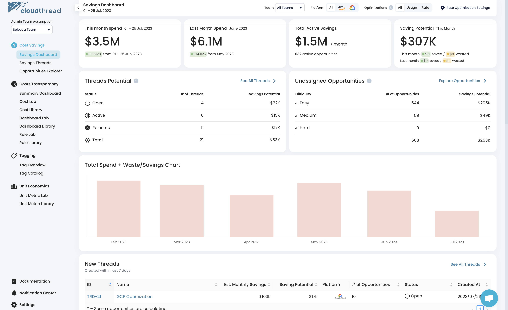
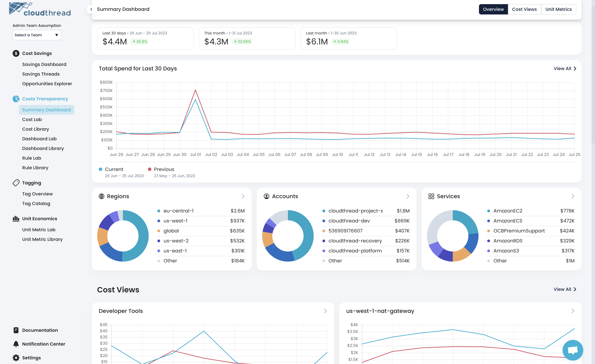
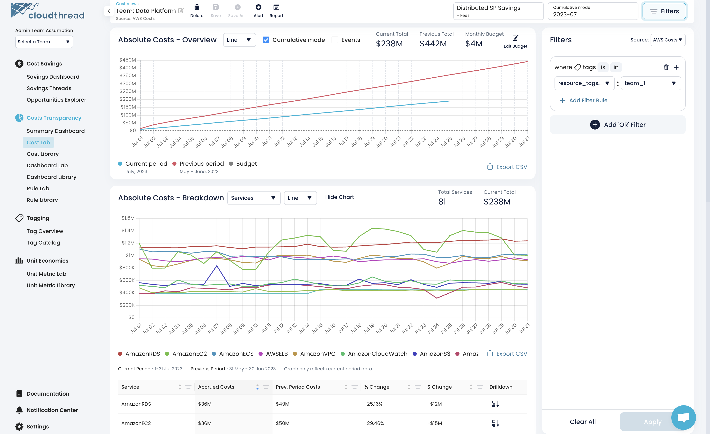
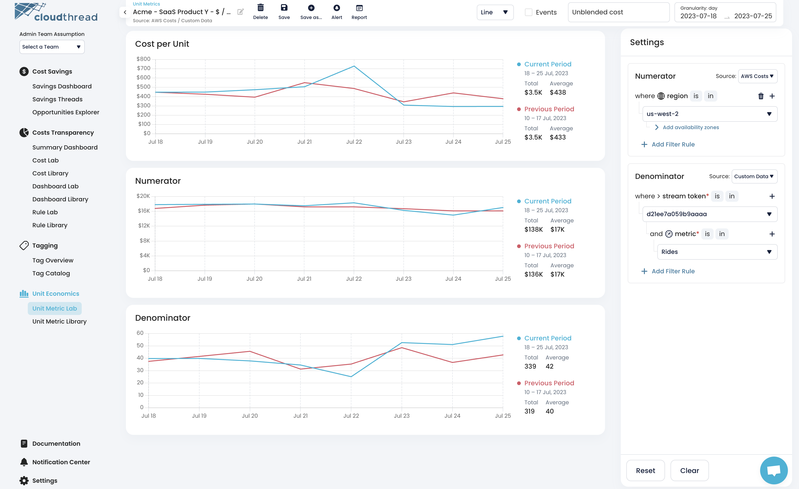
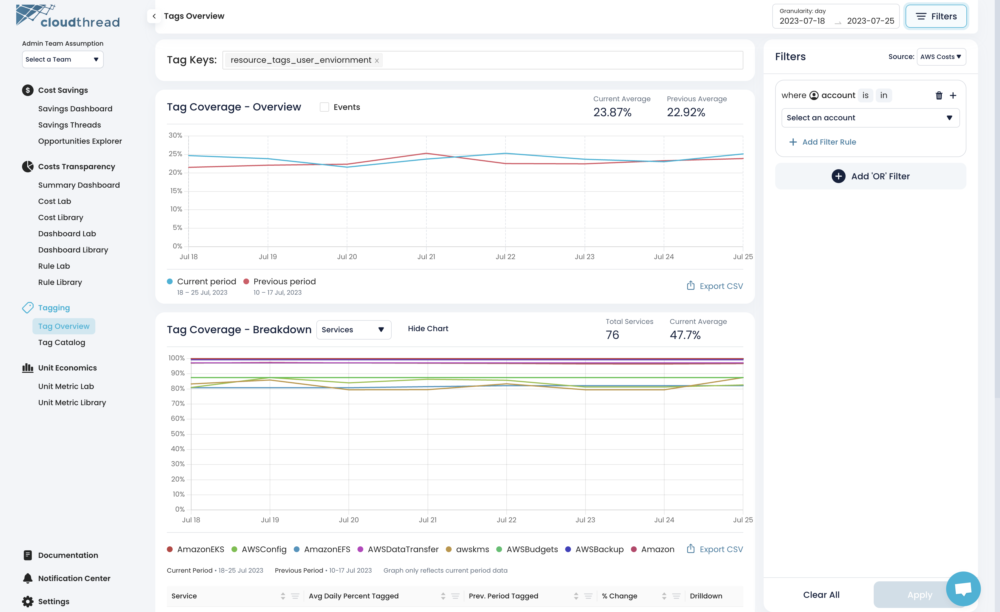

# ☁ What Is Cloudthread


**Cloudthread** is an **analytics platform** aimed at reducing the complexity of **cloud cost management** process. It surfaces **cost savings opportunities**, automates **optimization workflows** and increases **transparency** of your cloud spend.

Don't have an account yet? Click [here](https://app.core.cloudthread.io/sign-up) to set one up!


Whether you're just getting started with **Cloud Financial Management** or you're a veteran that's looking to contribute to a mature **FinOps** process, we're excited to help. Our success is measured by your **engineering** team's **confidence** in their **cloud cost efficiency**.



<figure><figcaption>
Cloudthread Cost Savings Insights
</figcaption></figure>


[creating-saving-threads.md](guides/optimizing-cloud-costs/creating-saving-threads.md)




<figure><figcaption>
Cloudthread Cost Summary Dashboard
</figcaption></figure>


[creating-custom-dashboards.md](guides/monitoring-cloud-costs/creating-custom-dashboards.md)




<figure><figcaption>
Cloudthread Cost Analytics Dashboard
</figcaption></figure>


[performing-root-cause-analysis.md](guides/monitoring-cloud-costs/performing-root-cause-analysis.md)




<figure><figcaption>
Cloudthread Unit Metrics
</figcaption></figure>


[creating-custom-unit-metrics.md](guides/monitoring-cloud-costs/creating-custom-unit-metrics.md)




<figure><figcaption>
Cloudthread Tag Assistant
</figcaption></figure>


[setting-up-tag-catalog.md](guides/tagging-cloud-resources/setting-up-tag-catalog.md)





[quick-start.md](quick-start.md)



If you are just starting with cloud cost management (a.k.a. FinOps, Cloud Financial Management), the best place to learn about the topic is [**FinOps Foundation**](https://www.finops.org). They have all necessary resources to kickstart you as well as passionate community to support your efforts.

**Cloudthread** is a proud [**partner**](https://www.finops.org/tools-services/cloudthread/) of FinOps Foundation.


## With Cloudthread you can...

**Have a clear action plan.** Cloudthread platform provides a powerful **cost savings recommendation engine** that helps to guide optimization agenda.

**Analyze your cloud spend** in a minimalistic, easy-to-use interface. No more frustrating over-complicated tools.

**Track your cloud cost efficiency** with custom-defined **unit metrics**. We support various data sourced and let you create cloud cost unit metrics that are meaningful for your team.

**Understand what is important to track.** Based on your environment our system recommends unit metrics that make sense for you. So, if you not sure how to start with cloud cost efficiency and unit economics, we get you going.

**Be notified and always on top of your cloud spend.** Our reporting and alerting capabilities will deliver the most important information to the right people at the right time through the channels that matter.

## Starting takes just 10 min

You can get started with **advanced cloud cost management** within just **10 minutes**! [Create an account](https://app.core.cloudthread.io/sign-up) and refer to [onboarding](guides/onboarding/ "mention") section for a fast onboarding experience.


Cloudthread supports **AWS** and **GCP** – you can find the set up steps for both provides in the sections below.&#x20;



[connecting-aws-account.md](guides/onboarding/connecting-aws-account.md)



[connecting-gcp-billing-account.md](guides/onboarding/connecting-gcp-billing-account.md)


If you ever need help setting things up or have feature requests, don't hesitate to reach out to us at [hey@cloudthread.io](mailto:hey@cloudthread.io)
