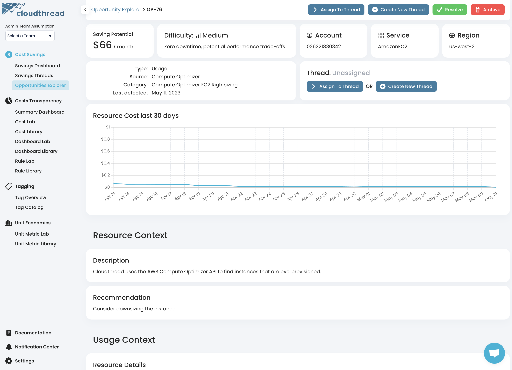

# Opportunities Explorer

**Opportunities Explorer** is the section of the app where you can manage [optimization-opportunities.md](key-concepts/optimization-opportunities.md "mention").

<figure><figcaption>
Cloudthread Opportunities Explorer
</figcaption></figure>

## Key Features

### Create New Opportunity Button

Cloudthread allows for creation of custom optimization opportunities. This button starts the creation flow. Refer to [creating-custom-optimization-opportunities.md](../../guides/optimizing-cloud-costs/creating-custom-optimization-opportunities.md "mention") for more details.

### Unassigned Opportunities Table

List of all discovered and custom opportunities that were not assigned to any thread:

* Opportunity ID
* Record ID
  * Resource ID or Discount code
* [Estimated Monthly Savings](key-concepts/optimization-opportunities.md#estimated-savings)
* [Difficulty](key-concepts/optimization-opportunities.md#difficulty)
* [Type](key-concepts/optimization-opportunities.md#optimization-type)
* [Category](key-concepts/optimization-opportunities.md#recommendation-context)
* [Status](key-concepts/optimization-opportunities.md#workflow-context)
* [Resource context](key-concepts/optimization-opportunities.md#resource-context)
  * Account
  * Region
  * Service
  * Tags
* First Detected
* Last Detected


Each row in the table can be **extended** to see the raw JSON details on opportunity.


The rows of the table are **selectable.** For the selected rows 3 actions are available (buttons at the top of the table):

* Create New Thread
* Assign To Thread
* Archive Selected

#### Create New Thread Button

Redirects to a form for creating a new Thread (see [savings-threads.md](key-concepts/savings-threads.md "mention")) with selected opportunities.

#### Assign To Thread Button

Redirects to a form for adding opportunities to an existing Thread (see [savings-threads.md](key-concepts/savings-threads.md "mention")).

#### Archive Selected Button

Moves selected opportunities to [#archived-opportunities-table](opportunities-explorer.md#archived-opportunities-table "mention"). This functionality allows to **ignore** the opportunities that are **irrelevant** and will not be implemented.


Opportunities can be **archived** by clicking trash bin button in Actions column at the end of the table.


### Archived Opportunities Table

The table with matching structure tot he above containing archived opportunities.


Archived opportunities can be **restored** by clicking restore button in Actions column at the end of the table.


### Opportunity Details Page

<figure><figcaption>
Cloudthread Optimization Opportunity Details
</figcaption></figure>

By clicking on the **Opportunity ID** in the tables above, you will be redirected to **Opportunity Details Page** containing detailed context on the optimization opportunity. See [optimization-opportunities.md](key-concepts/optimization-opportunities.md "mention") for description of the context types.

#### Assign To Thread Button

Redirects to a form for adding current opportunity to an existing Thread (see [savings-threads.md](key-concepts/savings-threads.md "mention")).

#### Create New Thread Button

Redirects to a form for creating a new Thread (see [savings-threads.md](key-concepts/savings-threads.md "mention")) with current opportunity.

#### Resolve Button

Marks current opportunity as **Done** (see [status](key-concepts/optimization-opportunities.md#workflow-context)).

#### Archive Button

Marks current opportunity as **Archived** (see [status](key-concepts/optimization-opportunities.md#workflow-context)).

#### Savings Potential Card

[Estimated monthly savings](key-concepts/optimization-opportunities.md#estimated-savings) expected from opportunity implementation.

#### Difficulty Card

Opportunity [difficulty](key-concepts/optimization-opportunities.md#difficulty).

#### Resource Details Cards

Major [details](key-concepts/optimization-opportunities.md#resource-context) of cloud resource.

#### Recommendation Details Card

Recommendation [context](key-concepts/optimization-opportunities.md#recommendation-context).

#### Resource Cost Chart

The chart with the cost of resource over time.

#### Resource Context Section

Detailed context for the resource.

#### Usage Context Section

Enriched context for resource usage.

#### Resource Details Section

Raw JSON for resource details.


JSON is great for copying over and extracting the relevant information by **engineers**.&#x20;


#### Opportunity Full Metadata Section

Raw JSON for recommendation details.


JSON is great for copying over and extracting the relevant information by **engineers**.&#x20;

