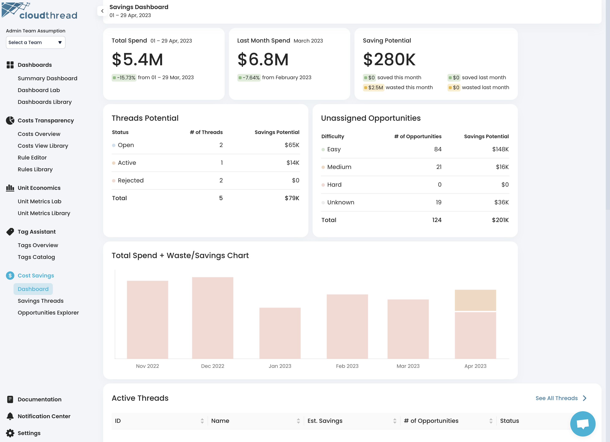

# Savings Dashboard

**Savings Dashboard** is the section of the app where you can see the high-level overview of cost savings workflows represented by [savings-threads.md](key-concepts/savings-threads.md "mention").


Savings Dashboard is not connected to [dashboards](../dashboards/ "mention") functionality of [cost-transparency](../cost-transparency/ "mention") set of features. It is a separate entity covering [.](./ "mention") functionality.


<figure><figcaption>
Cloudthread Savings Dashboard
</figcaption></figure>

## Key Features

### Cost Insights Cards

* Total spend for current month
* Total spend for previous month
* Saving Potential card
  * Estimated monthly savings from unaddressed [optimization-opportunities.md](key-concepts/optimization-opportunities.md "mention")

### Workflow Summary Cards

* Summary statistics on [savings-threads.md](key-concepts/savings-threads.md "mention")
* Summary statistics on [optimization-opportunities.md](key-concepts/optimization-opportunities.md "mention")

### Savings Chart

* Total Spend + Waste/Savings Chart

### Thread Tables

* Active Threads table
* Stale Threads table
* Recently Rejected Threads table

### Opportunity Tables

* New Opportunities table
