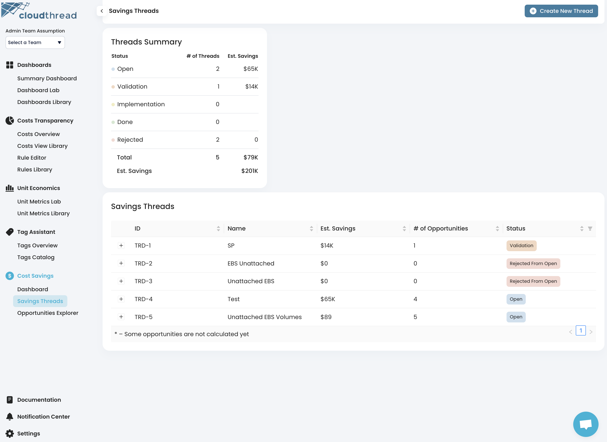

# Savings Threads \[App Section]

**Savings Threads** is the section of the app where you can manage [savings-threads.md](key-concepts/savings-threads.md "mention").

<figure><figcaption>
Cloudthread Savings Threads Section
</figcaption></figure>

## Key Features

### Create New Thread Button

Creating a new thread functionality.

### Threads Summary Card

Summary of the [savings-threads.md](key-concepts/savings-threads.md "mention") created:

* Number of threads and estimated savings by thread status (see [#optimization-context](key-concepts/savings-threads.md#optimization-context "mention"))

### Savings Threads Table

List of all the threads with the following columns:

* Thread ID
* Thread Name
* Estimated Monthly Savings
* Number of Opportunities assigned
* Status


Each row in the table can be **extended** to see the list of **assigned** **opportunities**.


### Assigned Opportunities Table

List of all opportunities assigned to threads. Filtered view of the [opportunities-explorer.md](opportunities-explorer.md "mention") main table.

### Savings Thread Details Page

<figure><figcaption>
Savings Thread Details Page
</figcaption></figure>

By clicking on the **Thread ID** in the tables above, you will be redirected to **Savings Thread Details Page** containing detailed context on the thread. See [savings-threads.md](key-concepts/savings-threads.md "mention") for description of the context types.

#### Start Workflow Button

The button for creating a **JIRA ticket** based on the Thread. It starts the implementation workflow and changes the thread status to **Active.**

<figure><figcaption></figcaption></figure>


**JIRA integration** is required. See [#jira-integration](../settings/slack-integration.md#jira-integration "mention") for details.


#### Reject Thread Button

Rejects thread and sets its status to **Rejected**.


All the opportunities of rejected thread are getting **archived**.


#### Savings Potential Card

Total savings potential of the thread.

#### JIRA Issues Card

List of all JIRA issues associated with he thread.

#### Description Card

Details of the thread (entered at the time of thread creation).

#### Opportunities Table

List of [optimization-opportunities.md](key-concepts/optimization-opportunities.md "mention") assigned to the Thread.

#### GitHub PRs Table

List of GitHub PRs associated with the Thread.

