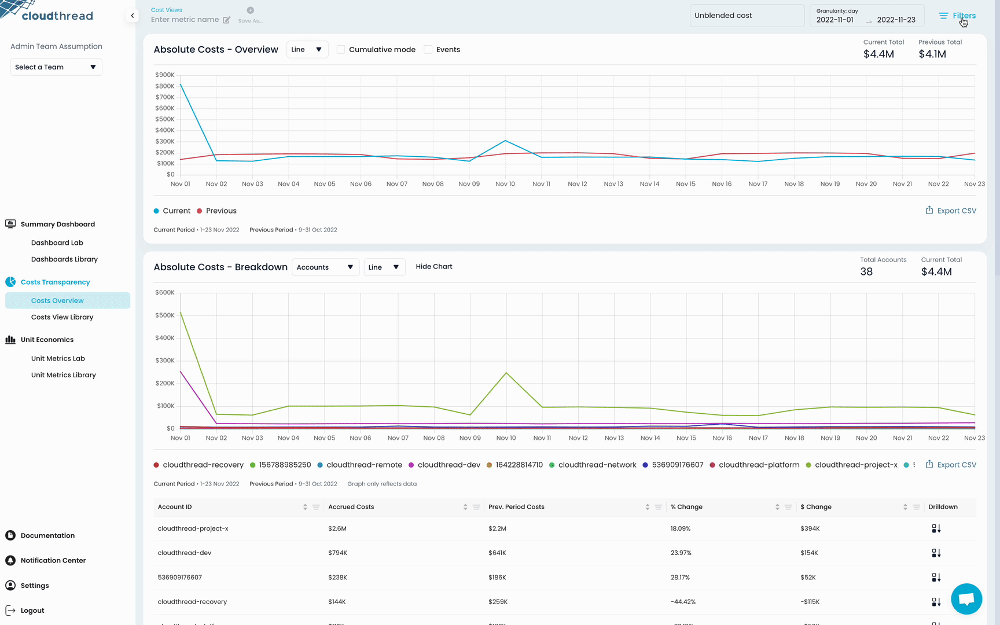
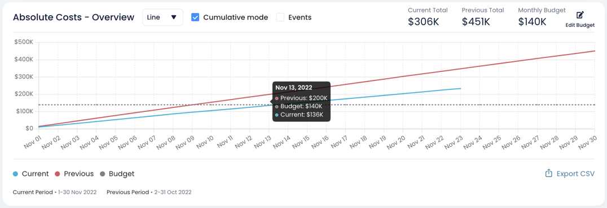

# Costs Overview

**Costs Overview** is the section of the app where you can see insights and adjust [cost-view.md](cost-view.md "mention").

### Key Features

[#cost-view-control-pane](costs-overview.md#cost-view-control-pane "mention")

[#absolute-cost-chart](costs-overview.md#absolute-cost-chart "mention")

[#absolute-cost-breakdown-chart](costs-overview.md#absolute-cost-breakdown-chart "mention")

[#tag-analyzer](costs-overview.md#tag-analyzer "mention")

#### Cost View Control Pane

This is the top pane of the page that includes:

* Cost View name
* Filter indicator
* **Delete**, **save as new** and **save changes** buttons
* [#date-picker](costs-overview.md#date-picker "mention") and [#filter-pane](costs-overview.md#filter-pane "mention")

#### Date Picker

Date Picker is providing a convenient interface for setting the time dimension for the analysis. It includes the following functionality:

* **Quick period** setting
  * Quick start and end date definition
  * Yesterday, Last Week, Last Month, Last Quarter, Last Year
* **Granularity** setting
  * Aggregation of data by time dimension
  * Day (default), Week, Month, Quarter, Year

.png>)

#### Filter Pane

Filter pane is designed for a convenient filtering of AWS cost data and [creating-custom-cost-views.md](../../guides/creating-custom-cost-views.md "mention").


Cloudthread allows for complex filtering of AWS cost data across **Account**, **Region**, **Service** and **Tag** dimensions. Both **AND** and **OR** filter conditions are supported as well as **IS** and **IS NOT** clauses.


<figure><figcaption>
Filter Pane
</figcaption></figure>


Filtering includes **regular expressions**.


#### Absolute Cost Chart

Absolute cost chart with **current** and **previous** period spend vs. time lines.


**Previous period** is defined as period of equal length directly proceeding the current period. E.g. if current period is June 17, 2022 - June 24, 2022, previous period is June 9, 2022 - June 16, 2022.


The chart has setting for **Line** or **Bar** styles, and **Cumulative mode** (showing the cumulative data for current and previous month spend).

Also the chart has [budgets.md](budgets.md "mention") functionality and [events-overlay.md](events-overlay.md "mention") (if enabled through [custom-data-api.md](../custom-data-api.md "mention")).

#### Absolute Cost Breakdown Chart

Absolute cost chart with the **additional** data dimension, but no previous period displayed.

This chart also has a data table attached to see the breakdown in more convenient way and control [drill-down.md](drill-down.md "mention").

#### Tag Analyzer

Table with spend distributed by tag. See [tag-analyzer.md](tag-analyzer.md "mention") for more details.
