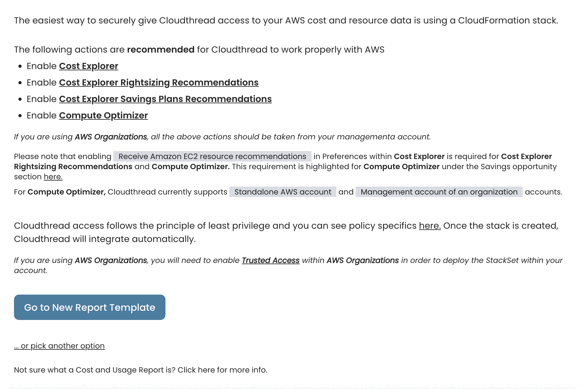

# Costs Overview

**Costs Overview** is the section of the app where you can see insights and adjust [cost-view.md](cost-view.md "mention").

### Key Features

#### Cost View Control Pane

This is top pane of the page that includes:

* Cost View name
* Filter indicator
* Cost View **delete**, **save as new** and **save changes** buttons
* [#date-picker](costs-overview.md#date-picker "mention") and [#filter-pane](costs-overview.md#filter-pane "mention")

#### Absolute Cost Chart

Absolute cost chart with **current** and **previous** period spend vs. time lines.


**Previous period** is defined as period of equal length directly proceeding the current period:

* If current period is May 1, 2022 - May 7, 2022, previous period is April 24, 2022 - April 30, 2022


 (1).png>)

#### Absolute Cost Breakdown Chart

Absolute cost chart with the **additional** data dimension, but no previous period displayed.

This chart also has a data table attached to see the breakdown in more convenient way and control [drill-down.md](../drill-down.md "mention").

#### Date Picker

This is functionality for setting the dates for the cost insights.

.png>)

#### Filter Pane

Filter pane is designed for a convenient filtering of AWS cost data and [creating-custom-cost-views.md](../../guides/creating-custom-cost-views.md "mention").


Cloudthread allows for complex filtering of AWS cost data across **Account**, **Region**, **Service** and **Tag** dimensions. Both **AND** and **OR** filter conditions are supported as well as **IS** and **IS NOT** clauses.


