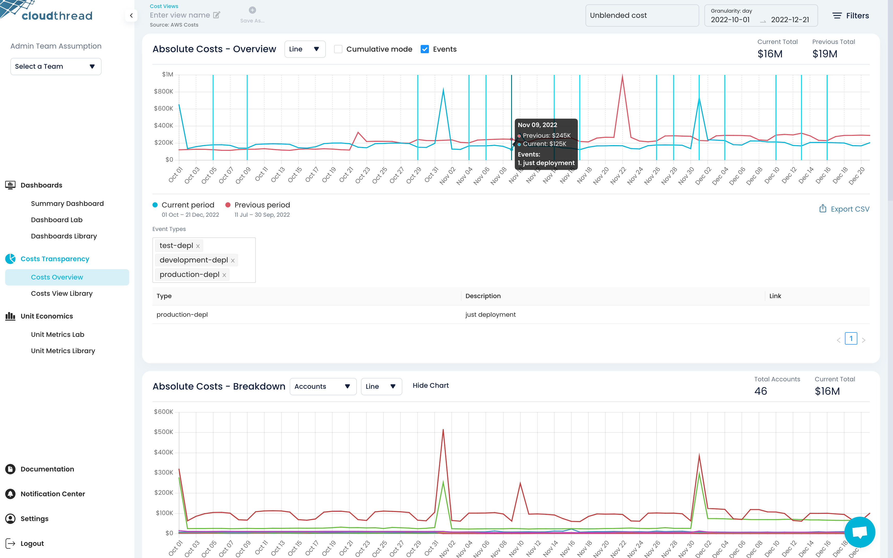

# Events Overlay

**Events Overlay** allows to display historical events on [#absolute-cost-chart](../costs-overview.md#absolute-cost-chart "mention") in [costs-overview.md](../costs-overview.md "mention") section for [cost-view.md](cost-view.md "mention").

The events data gets uploaded to the platform through an [API](http://localhost:5000/o/TmVItW5TwUC23RxcuDg9/s/KuhDuXL0YPX22VMOHZWV/ "mention") in a time series format, following [ingesting-custom-data.md](../../../guides/monitoring-cloud-costs/ingesting-custom-data.md "mention") process.

<figure><figcaption>
Events Overlay
</figcaption></figure>
