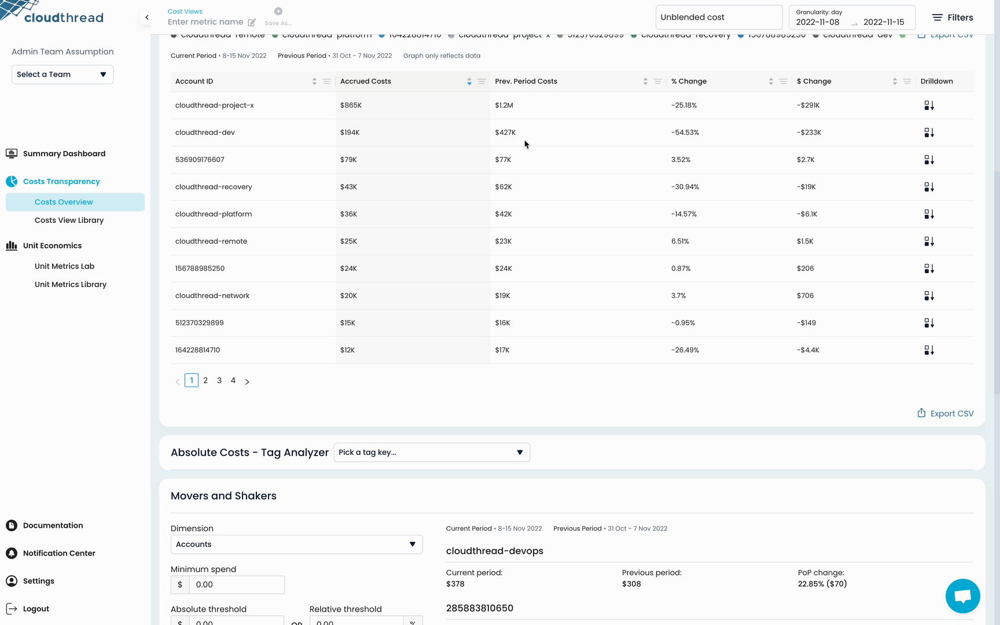

# Movers and Shakers Snapshot

This is part of our reporting functionality that allows you to set up spend thresholds on entire dimensions (Service, Account, Region), and get weekly reports or daily digests highlighting only the threshold-passing changes.

Classic anomaly detection is great, but it always has to deal with the signal vs. noise tradeoff, and no one gets it right. Cloudthread gives its spin on the solution of this problem by introducing Movers and Shakers reports – a reporting functionality that stands between simple threshold alerts and full-fledged anomaly detection.

Platform now allows setting spend thresholds (both absolute and relative, i.e. %) on the key dimensions, and have a convenient insight into what is "moving and shaking" – every week as part of weekly [reports.md](../notifications/reports.md "mention"), or on a daily basis (concise report sent to Slack or email only in case the thresholds are broken on a given day). The key convenience part is coming from the fact that the entire dimensions are covered by a single setup, and you get the comprehensive list of key changes happening within the dimension, in a controlled way. We currently support AWS Account, Region and Service dimensions, and more are on the way.\

<figure><figcaption></figcaption></figure>
