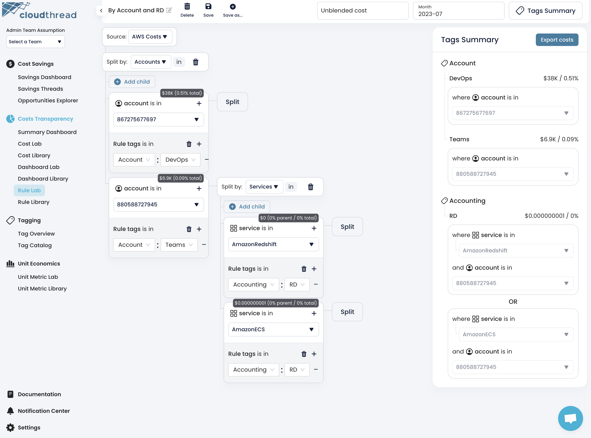
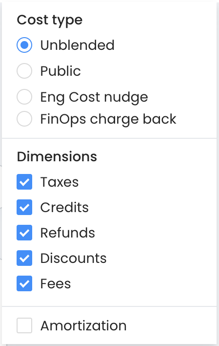

# Rule Lab

**Rule Lab** is the section of the app where you can define [cost-allocation-rules.md](key-concepts/cost-allocation-rules.md "mention").

<figure><figcaption>
Cloudthread Rule Lab
</figcaption></figure>

## Key Features

### Rule Lab Control Pane

<figure><figcaption></figcaption></figure>

This is the top pane of the page that includes:

* Rule name
  * This is editable
* **Delete**, **Save** and **Save As** buttons
* [#cost-type-selector](rule-editor.md#cost-type-selector "mention")
* [#month-picker](rule-editor.md#month-picker "mention")

#### Cost Type Selector

Allows for choosing the cost type and adding/removing cost components such as Taxes, Credits, Refunds, Discounts, Fees as well as Amortization.

<figure><figcaption></figcaption></figure>

#### Month Picker

Needed for showing the total cost per rule.

<figure><figcaption></figcaption></figure>

### Tags Summary Pane

This pane summarizes all Custom Tags you have created in Rule Lab.

<figure><figcaption></figcaption></figure>

#### Export Costs Button

The button saves the costs distributed by tags (by cost allocation rules) in CSV format.

### Rule Lab Interface

This is the interface for creating and editing the [cost-allocation-rules.md](key-concepts/cost-allocation-rules.md "mention").

<figure><figcaption></figcaption></figure>

The interface has **2 major steps**:

1. Costs source dropdown
2. Split Dimension dropdown

#### Costs Source Dropdown

Currently 2 options are available:

* AWS Costs
* Custom Data from [custom-data-api.md](../custom-data-api.md "mention")

#### Split Dimension Dropdown

The data dimensions for the split, based on the [#costs-source-dropdown](rule-editor.md#costs-source-dropdown "mention")

* For AWS:
  * Accounts
  * Payer Accounts
  * Regions
  * Tags
  * Services
  * Invoice IDs
  * Charge Categories
  * Purchase Options
  * RI / SP ARNs


You can see the instructions on how to create the rule in [setting-up-cost-allocation-rules.md](../../guides/monitoring-cloud-costs/setting-up-cost-allocation-rules.md "mention") guide.

