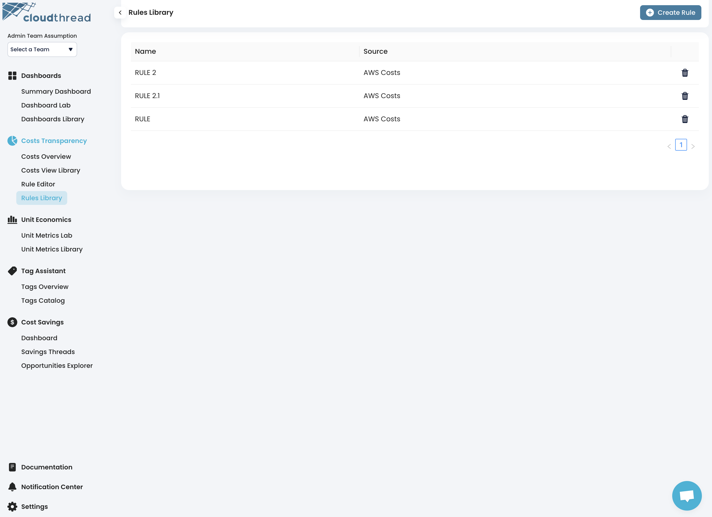

# Rules Library

**Rules Library** is the section of the app where you can see and manage all saved [cost-allocation-rules.md](key-concepts/cost-allocation-rules.md "mention").

<figure><figcaption>
Cloudthread Rules Library
</figcaption></figure>
