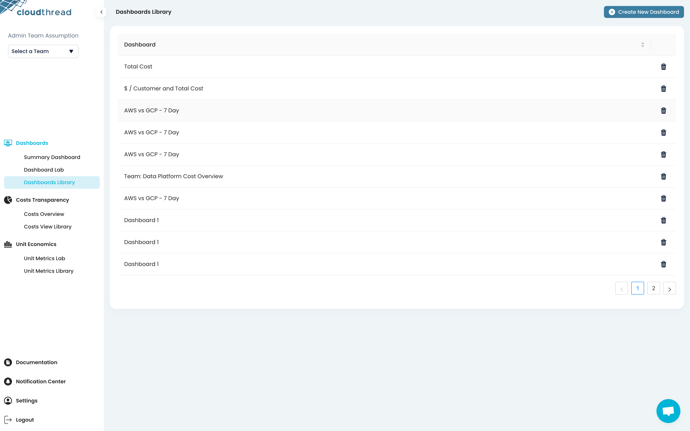

# Dashboards Library

**Dashboards Library** is the section of the app where you can see all the saved [.](./ "mention")listed: both custom and predefined ones.

To add the dashboard to the Library, see [creating-custom-dashboards.md](../../guides/creating-custom-dashboards.md "mention") guide.

<figure><figcaption>
Dashboards Library
</figcaption></figure>
