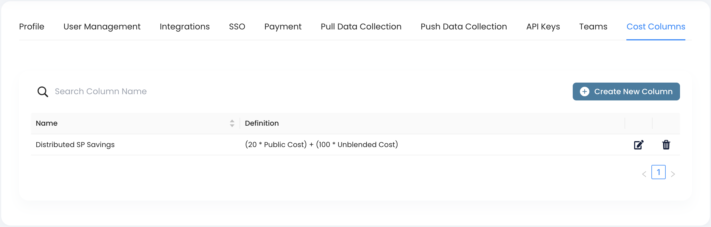

# Cost Columns

**Custom Cost Columns** is the feature that allows to create new cost metrics based on the existing ones. It is basically the functionality around adding new calculated column to the cost dataset based on a formula involving current columns and arithmetic operations.


Currently Cloudhtread supports **Unblended Cost** and **Public Cost** as the base columns.


<figure><figcaption></figcaption></figure>
