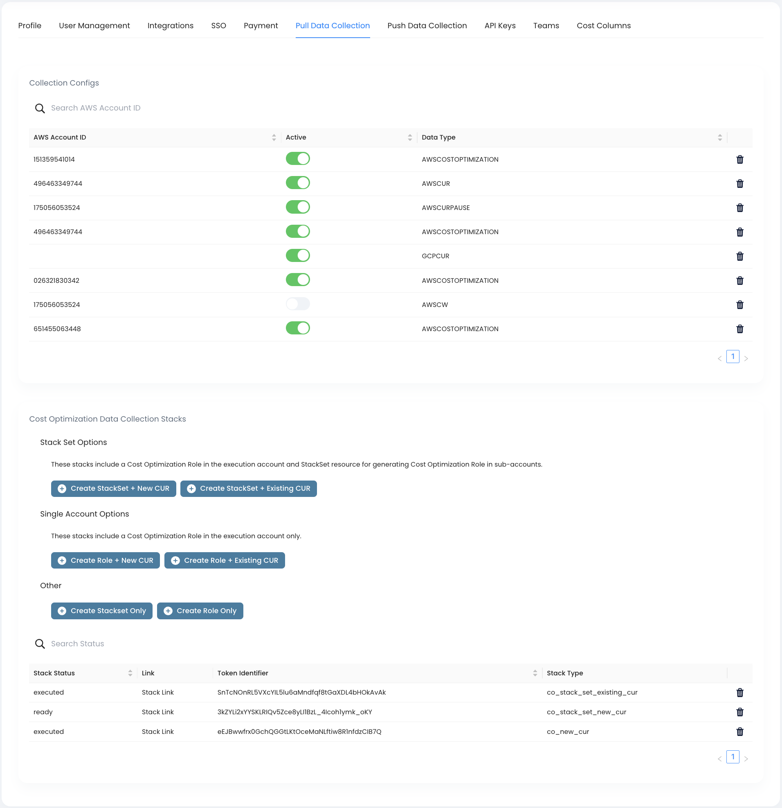

# Pull Data Collection

Cloudthread provides easy integrations for data sets across your environment. The information below explains different integrations options to have Cloudthread pull or push data from your environment.

<figure><figcaption></figcaption></figure>

## AWS

Cloudthread's AWS integrations are all Cloudformation Stack based.

There are four options:
1. New Cost and Usage report for a single AWS account
2. New Cost and Usage report for AWS master and sub-acounts (AWS Organizations)
3. Existing Cost and Usage report for a single AWS account
4. Existing Cost and Usage report for AWS master and sub-acounts (AWS Organizations)

You can generate these templates in the Settings > Data Collection part of the platform.

**Cloudthread existing Cost and Usage report requirements**:

1. Hourly time granularity
2. Parquet file type
3. Overwrite Report file versioning
4. Resource ID level report content

### New Cost and Usage report

This stack template is for companies who do not already have a Cost and Usage report that matches Cloudthread's requirements. This template should be run in your main account if you're not using AWS Organizations, or in your organization root account if you are using AWS Organizations. If you're using AWS Organizations your organization Root ID will be required.

### Existing Cost and Usage Report

This stack template is for companies who have an existing Cost and Usage report that matches Cloudthread's requirements. You will be required to submit your report name, report prefix, and report bucket in the creation form. This template should be run in your main account if you're not using AWS Organizations, or in your organization root account if you are using AWS Organizations. If you're using AWS Organizations your organization Root ID will be required.

Exact permissions can be found in [Cloudthread Policy](../../policy\_cfn\_cldthrd.yaml)

## Kubernetes

Cloudthread's K8s integration is Helm Chart based.

Cloudthread requires a **Data Stream Token** to process incoming K8s ingestion requests (similar to Custom API requests). This token helps organize and control the flow of data. Data Stream Tokens are generated with a **Data Stream Type** that determines how the incoming data is validated. Admin's have the ability to generate a Data Stream Token on the Cloudthread platform within the **Settings** tab.

### Kubernetes EKS

Our K8s EKS integration requires a data stream token to be generated with **Data Stream Type** `kubernetes` - generating this token will also generate the AWS Role Arn and External ID required for a K8s EKS integration.

1. Generate a **Data Stream Token** with **Data Stream Type** `kubernetes` from the **Settings** tab
2. Copy the generated data stream token, AWS credentials (Role Arn and External ID), and your Organiztion ID
3. Add cloudhtread helm charts with: `helm repo add cloudthread https://cloudthread.github.io/helm-charts/`
4. Create a kubernetes namespace to run the exporter `kubectl create namespace cloudthread`
5. Install kubernetes exporter with a command like this one:

```
helm install kubex cloudthread/cloudtread-kubex  \
    --namespace cloudthread \
    --set cloudthread.role_arn= YOUR ROLE_ARN \
    --set cloudthread.role_external_id=  YOUR ROLE_EXTERNAL_ID \
    --set cloudthread.stream_token= YOUR STREAM_TOKEN  \
    --set cloudthread.org_id= YOUR ORGANIZATION_ID  \
    --set cloudthread.dst_bucket=cloudthread-push \
    --set cloudthread.cluster_id= OPTIONAL HUMAN READABLE CLUSTER ID \
    --set cloudthread.region= CLOSEST AWS REGION
```

### Kubernetes EC2

Coming soon! Please contact support@cloudthread.io for more info.
