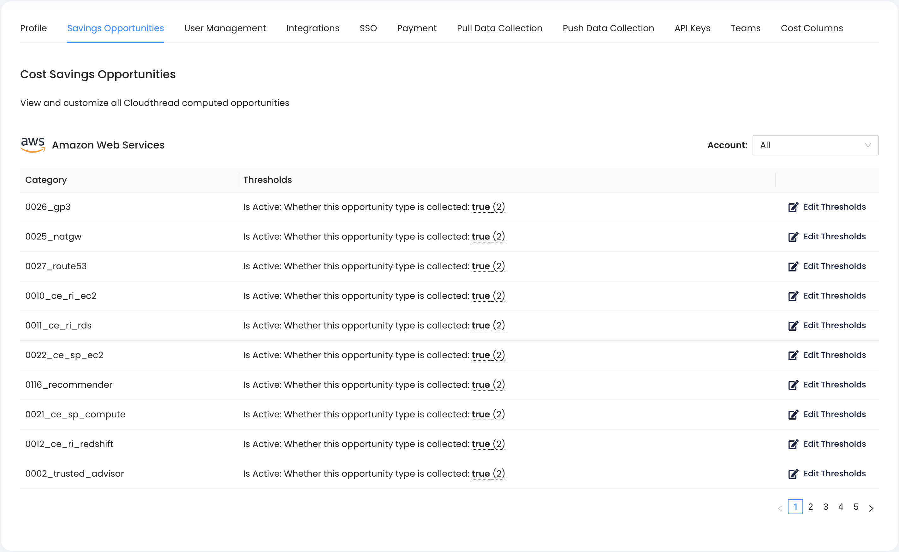
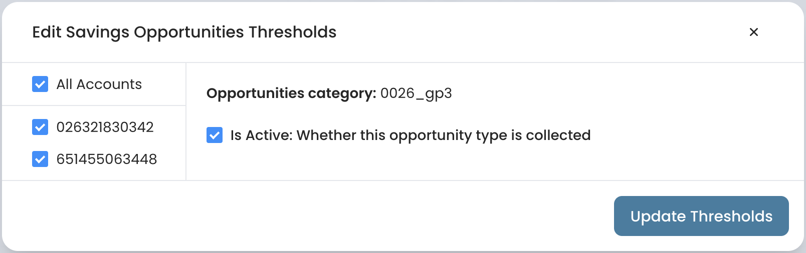
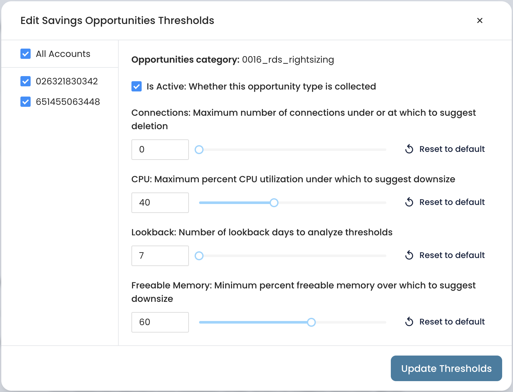
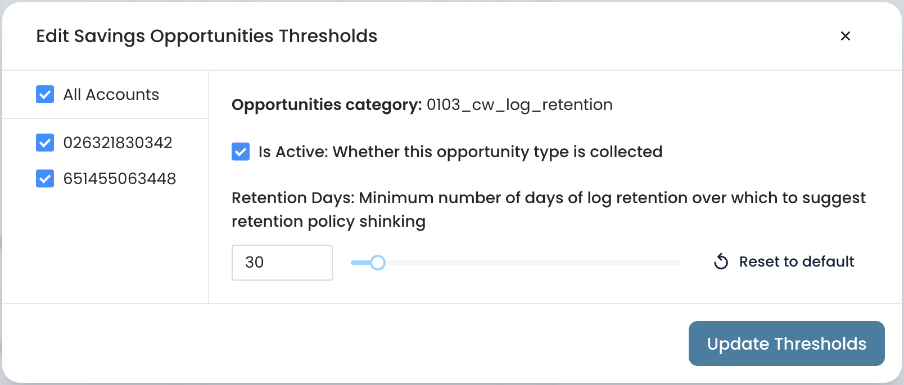

# Savings Opportunities Settings

This is the section of [.](./ "mention") that allows to modify [optimization-opportunities.md](../cost-savings/key-concepts/optimization-opportunities.md "mention") detection criteria.

<figure><figcaption></figcaption></figure>


Opportunity settings can be defined for **all** the accounts or for the **specific** accounts.


## Savings Opportunities settings types

All [optimization-opportunities.md](../cost-savings/key-concepts/optimization-opportunities.md "mention") have the **On/Off** setting, i.e. you can mange if certain opportunities are being detected for the specific accounts (or all the accounts).

<figure><figcaption></figcaption></figure>

For some opportunities there are additional settings available. These are mainly opportunities of **Usage type** (see [#optimization-type](../cost-savings/key-concepts/optimization-opportunities.md#optimization-type "mention") for more context). Examples of the adjustable threshold settings include:

* % CPU utilization
* Number of lookback days for analysis
* % of freeable Memory

<figure><figcaption></figcaption></figure>

<figure><figcaption></figcaption></figure>

