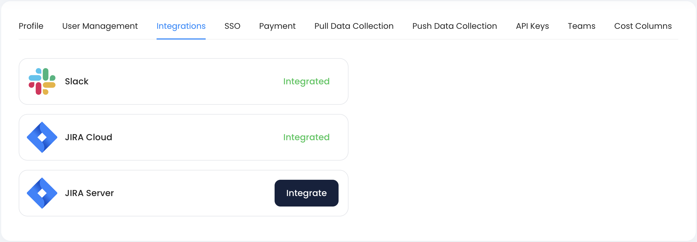
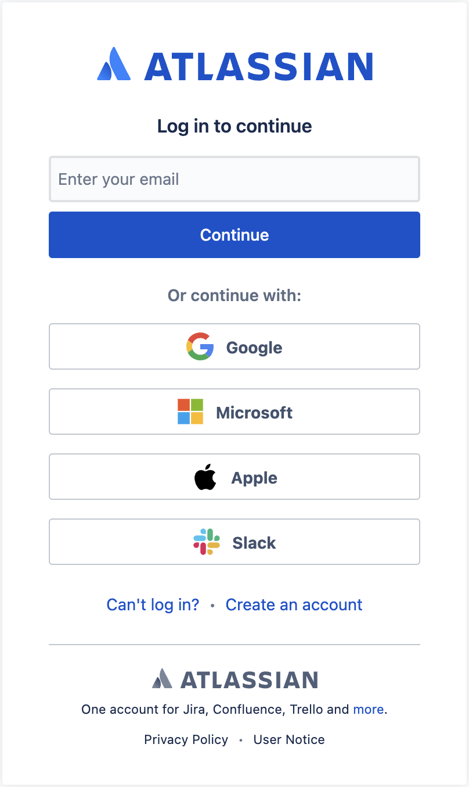
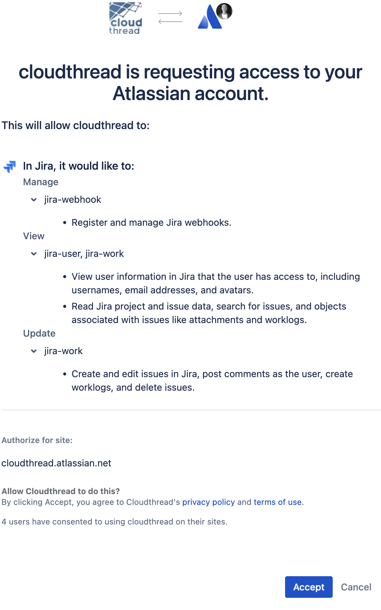
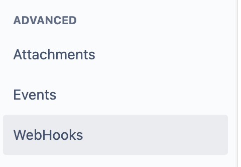
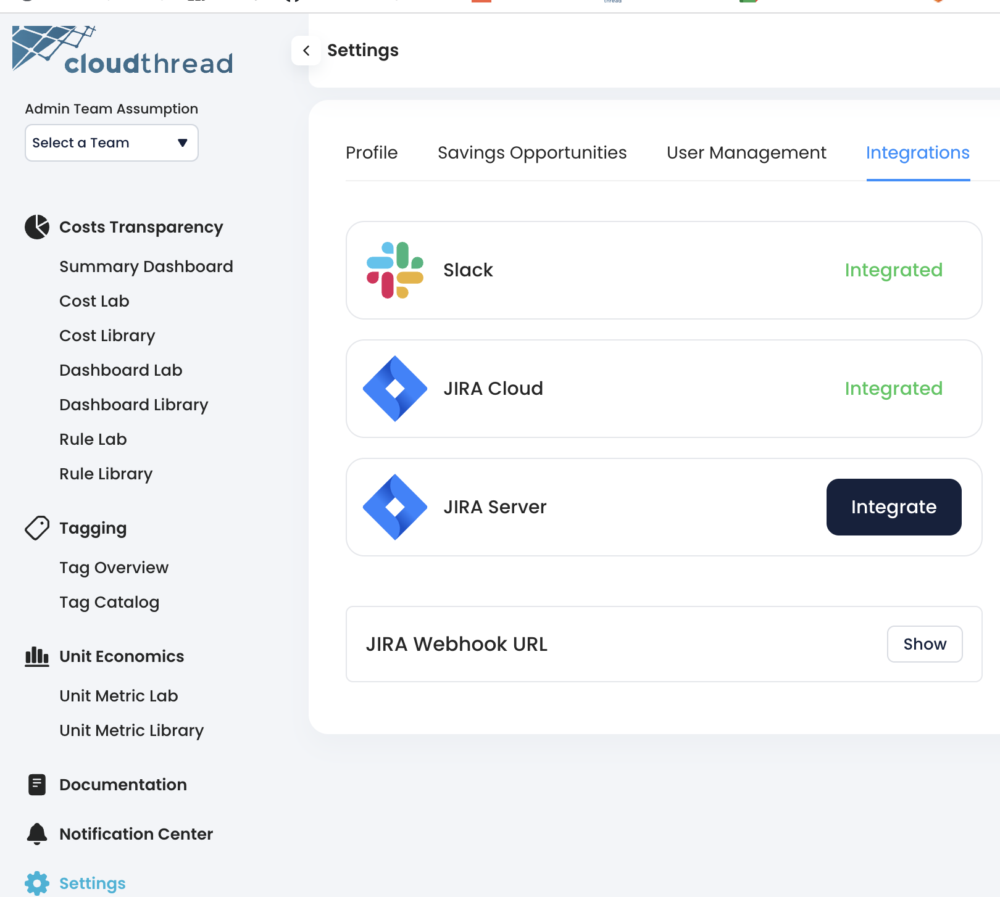
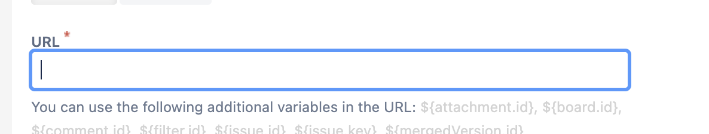

# Integrations

**Integrations** section of [.](./ "mention") has **Slack** and **Jira** integrations available.

<figure><figcaption></figcaption></figure>

## Slack Integration

In order to setup **Slack** for [alerts.md](../notifications/alerts.md "mention") and [reports.md](../notifications/reports.md "mention") you need to navigate to **Settings** menu item at the bottom part of the menu to the left, choose **Integrations** section and click Slack button.

After that you will be redirected to the Slack setup page.

Once you have Slack setup, you will have your workspace channels available in [setting-up-alerts-and-reports.md](../../guides/monitoring-cloud-costs/setting-up-alerts-and-reports.md "mention").

## Jira Integration

In order to use [savings-threads.md](../cost-savings/key-concepts/savings-threads.md "mention") workflow functionality, you need to set up Jira **integration.**


Cloudthread currently supports only [Jira project management](https://www.atlassian.com/software/jira) integration. Both **Cloud** and **Server** versions are supported.


### Jira Cloud

#### Detailed instructions&#x20;

1. Once you click `Integrate` in Integrations section of Settings, you will be redirected to Atlassian sign-in
2. Sign in or create an account for JIRA cloud
3.  Accept access request

    

    <figure><figcaption></figcaption></figure>

    

4. Come back to Cloudthread app to verify that integration is successful

<figure><figcaption></figcaption></figure>

### Jira Server

<figure><figcaption></figcaption></figure>

#### Detailed instructions&#x20;

1. Go to Jira Administration > Applications > Application Links
2. Click `Create Link` and select `External application` + `Direction Incoming`
3. For Name - set to whatever they want (`Cloudthread` is fine)
4. For Redirect URL  - set to [`https://app.cloudthread.io/settings/third-party-integrations?provider=jira_server`](https://app.cloudthread.io/settings/third-party-integrations?provider=jira\_server)
5. For Application permissions - set to `Write`
6. Click `Save`
7. Go to Cloudthread and Settings >Integrations and click `JIRA Server`
8. Enter:
9. Client ID from step 6
10. Client Secret from step 6
11. Jira server url including https:// and no trailing slash (e.g. [`https://mycompany.atlassian.server.com`](https://mycompany.atlassian.server.com/))
12. Follow through integration flow

### Jira Webhook


Some helpful information about adding a new webhook you can find in official [Jira documentation](https://developer.atlassian.com/cloud/jira/platform/webhooks/).


#### Detailed Instructions for Jira Cloud

1.  In Jira go into Settings → System

    

    <figure><figcaption></figcaption></figure>

    

2.  In Jira go into Advanced → Webhooks

    

    <figure><figcaption></figcaption></figure>

    

3.  Click on Create a `WebHooks` button

    

    <figure><figcaption></figcaption></figure>

    

4.  Copy webhook URL from Cloudthread → Settings → Integrations → JIRA Webhook URL

    

    <figure><figcaption></figcaption></figure>

    

5.  Put Cloudthread WebHook URL into URL field in `Create a WebHook` UI in Jira cloud

    

    <figure><figcaption></figcaption></figure>

    

6.  Select ‘updated’ and ‘deleted’ events for Jira issues. You are allowed to write a specific JQL query for the related project to reduce the amount of events that are sent to Cloudthread

    

    <figure><figcaption></figcaption></figure>

    

