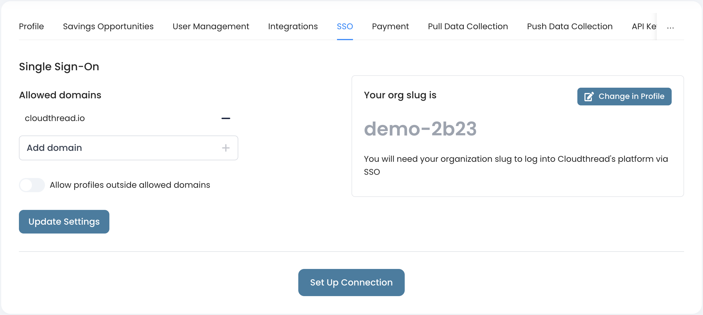
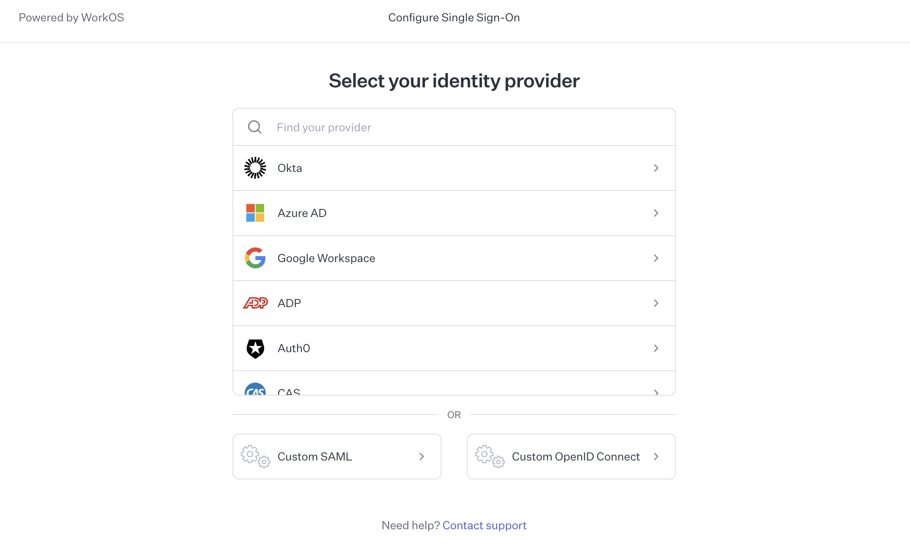

# SSO

Cloudthread supports **Single Sign On** functionality for Enterprise users.


[WorkOS Single Sign-On](https://workos.com/docs/sso) is used to enable SSO functionality. It supports all major SSO providers and allows for easy integration.


To enable SSO for your organisation, follow these steps:

1. Go to Settings -> SSO
2.  Add allowed domain and click `+` and then `Update Settings`

    * If you want to allow domains outside the allowed list, make sure to turn on the `Allow profiles outside allowed domains` toggle

    <figure><figcaption></figcaption></figure>
3.  Click `Set Up Connection` – you will be redirected to WorkOS interface

    * Choose the SSO provider you use and follow the instructions

    <figure><figcaption></figcaption></figure>
4. Change your org slug in [user-profile.md](user-profile.md "mention") section if needed

