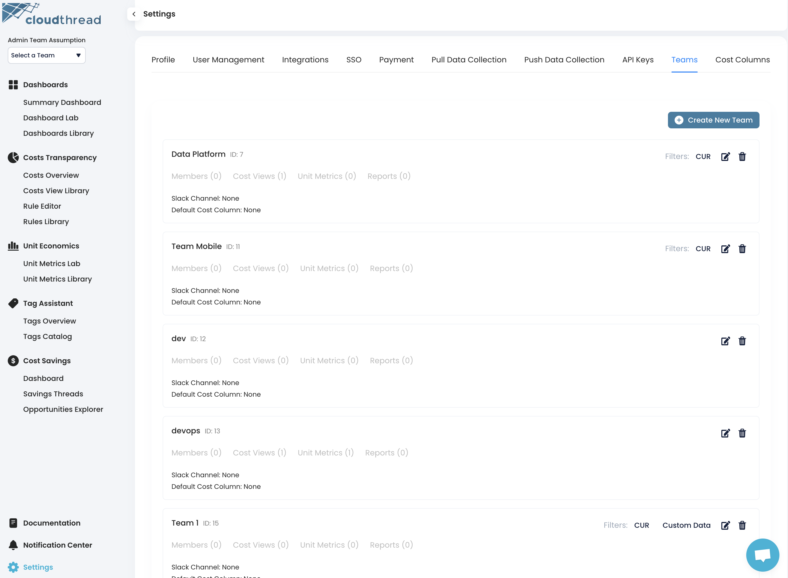
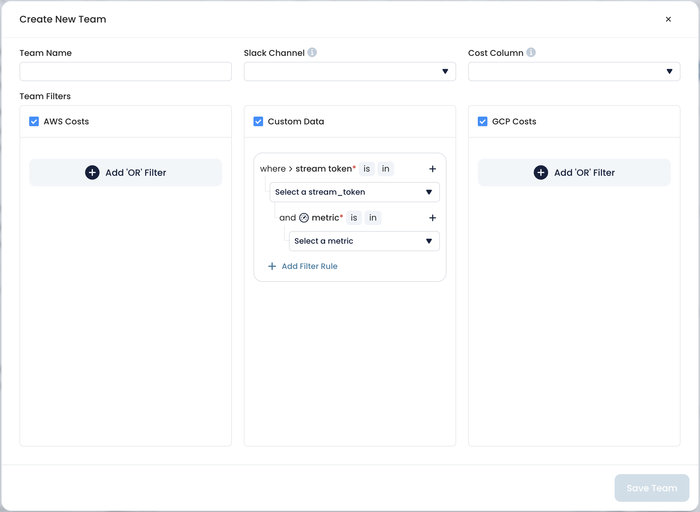

# Teams

Cloudthread platform allows to assign users to **Teams** that have **global filters** enabled, i.e. every user belonging to the Team can see all the data filtered without an ability to remove the filtering.

<figure><figcaption></figcaption></figure>

## Create New Team Form

Creating new team is performed via pressing the button and filling in the form.

The Team can tbe set up with:

* **Global filter**
* **Slack channel**
  * See [#slack-integration](slack-integration.md#slack-integration "mention")
* **Cost Columns**

<figure><figcaption></figcaption></figure>
