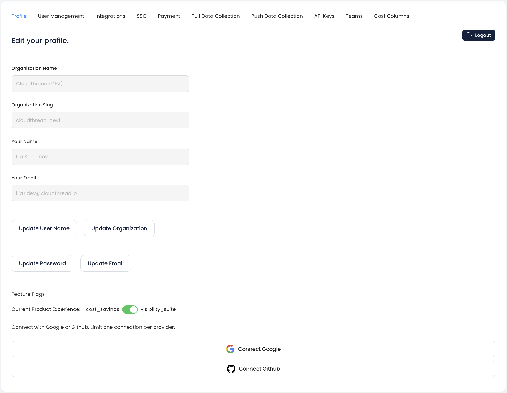

# Profile

This is the section of [.](./ "mention") that allows to modify **User Profile** information.

<figure><figcaption></figcaption></figure>

## Changeable profile features

* User Name
* Organization Name
* Email
* Password

## Feature Flags

Currently Cloudthread app supports 2 main modes: **Cost Savings** and **Visibility Suite.**

For some clients it is possible to choose between the modes by changing the feature flag.

#### Cost Savings Mode

Includes [cost-savings](../cost-savings/ "mention") features.

#### Visibility Suite Mode

Includes [cost-transparency](../cost-transparency/ "mention"), [unit-metrics](../unit-metrics/ "mention") and [tag-assistant](../tag-assistant/ "mention") features.
