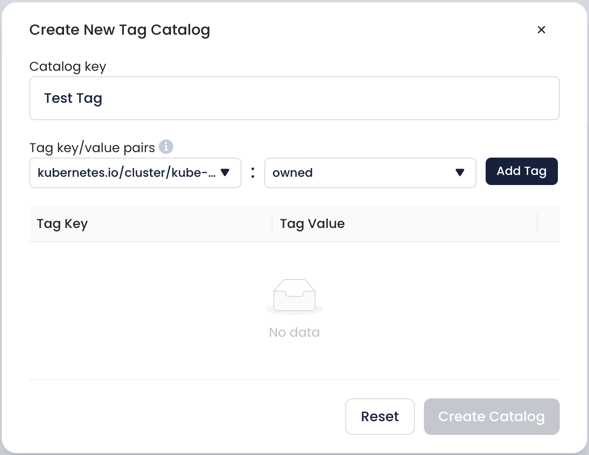
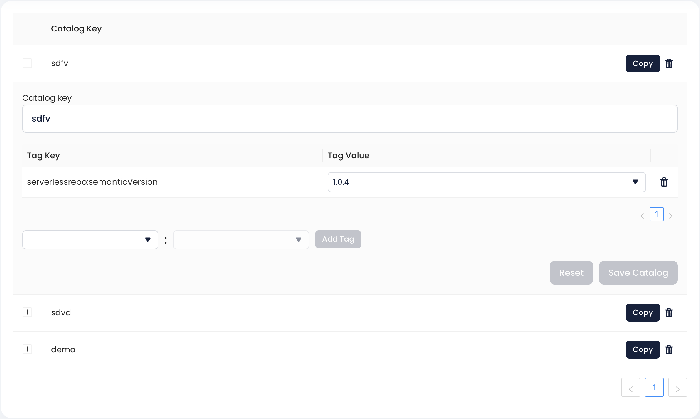

# Tags Catalog

**Tag Catalogs** is a section of an app that covers **tagging automation** functionality Cloudthread provides.

It represents the setup interface for **Tag Catalog** creation and maintenance.


Tag Automation currently is supported on **GitHub** and **Terraform** based Infrastructure as a Code (IaaC) environments.



You can also use our `/api/tag-catalog` endpoint directly [here](https://docs.cloudthread.io/v/api-docs/reference/api-reference/tag\_catalog) via the developer API to create your own automation.


Connected to a GitHub repository through [GitHub Actions](https://docs.github.com/en/actions), Tag Catalog allows to make sure all the Terraform builds in the repository get the tags outlined in the catalog. This allows to maintain consistent tagging and control it from a single place.

GitHub Actions should be set up for the repo with a Cloudthread **API Key** and **Tag Catalog Key** in Action Secrets. Based on the connection between GitHub and Cloudthread established this way, the tags from the catalog are getting propagated to the `.tf` build files in the repository: every time the action is run a PR adding new tags is created.

<figure><figcaption></figcaption></figure>

## Key Features

### Synchronize Tags Button

* This syncs your current active AWS Cost Allocation tags from Cost Explorer and retrieves values from the last 7 days over all integrated **AWS Master Accounts**
* These keys and values are then available for tag catalog tag key value pairs


If you want to add a new key to a tag catalog, you must first add it as a **Cost Allocation Tag** in AWS.

Only AWS Master Accounts have access to cost allocation tags - you must integrate at least one payer AWS account to use Tag Catalogs.


### Create API Key for Tag Assistant Button

This is needed for fetching tag catalog from the GitHub repository. Clicking the button redirects to [api-keys.md](../settings/api-keys.md "mention") settings page.

### Create New Catalog Button

This creates a new Tags Catalog. The idea is that **one tag catalog covers one repository**, so that different repositories can be tagged differently.

<figure><figcaption></figcaption></figure>

### Tags Catalog Table

This is the table containing tag Catalogs. It allows to set the tag key-value pairs within the Tag Catalog, saving the catalog state and resetting the Catalog.

<figure><figcaption></figcaption></figure>

