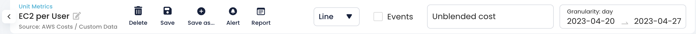
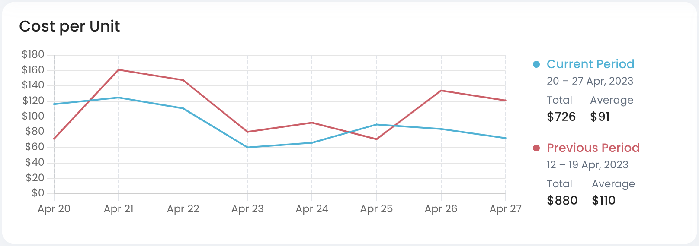
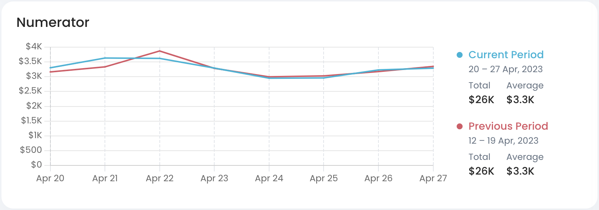
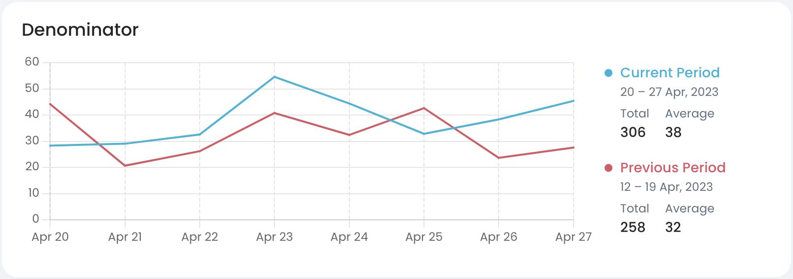

# Unit Metrics Lab

**Unit Metrics Lab** is the section of the app where you can see and adjust [unit-metric.md](key-concepts/unit-metric.md "mention") with charts and filters.


Refer to [creating-custom-unit-metrics.md](../../guides/monitoring-cloud-costs/creating-custom-unit-metrics.md "mention") guide to see how to create custom unit metrics.


## Key Features

### Unit Metrics Control Pane

<figure><figcaption></figcaption></figure>

This is the top pane of the page that includes:

* Unit Metric name
* Unit Metric source
  * This is where the denominator of the metric is coming from (CloudWatch, CUR, etc.)
* **Delete**, **Save as New** and **Save Changes** buttons
* [#date-picker](unit-metrics-lab.md#date-picker "mention") and [#settings-pane](unit-metrics-lab.md#settings-pane "mention")

#### Date Picker

 (2).png>)

#### Settings Pane

Filter pane in Unit Metrics Overview designed for customizing unit metrics (editing both numerator and denominator), for more instructions see [creating-custom-unit-metrics.md](../../guides/monitoring-cloud-costs/creating-custom-unit-metrics.md "mention")


Cloudthread allows for complex filtering of AWS cost data across **Account**, **Region**, **Service** and **Tag** dimensions. Both **AND** and **OR** filter conditions are supported as well as **IS** and **IS NOT** clauses.


### Cost per Unit Chart

Unit Metric cost chart with **current** and **previous** period spend vs. time lines.


**Previous period** is defined as period of equal length directly proceeding the current period:

* If current period is May 1, 2022 - May 7, 2022, previous period is April 24, 2022 - April 30, 2022


### Numerator Chart

Absolute cost chart for the **numerator** part of unit metric equation with **current** and **previous** period spend vs. time lines ($).

<figure><figcaption></figcaption></figure>

### Denominator Chart

Absolute cost chart for the **denominator** part of unit metric equation with **current** and **previous** period spend vs. time lines ($).

<figure><figcaption></figcaption></figure>
