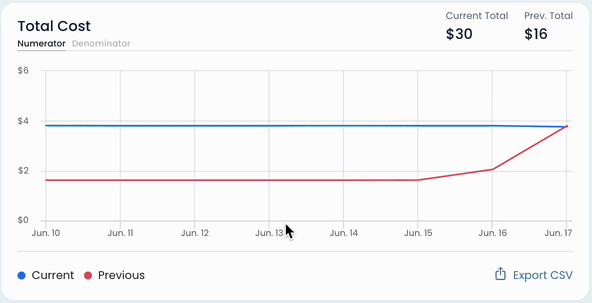

# Unit Metrics Overview

**Unit Metrics Overview** is the section of the app where you can see and adjust [unit-metric.md](unit-metric.md "mention") with charts and filters.


Unit Metrics Overview is accessible through [unit-metrics-library.md](unit-metrics-library.md "mention") by choosing one of the saved or predefined metrics.

Refer to [creating-custom-unit-metrics.md](../../guides/creating-custom-unit-metrics.md "mention") to see how to create an initial custom unit metric through simplified form and edit it further in Unit Metrics Overview.


### Key Features

#### Unit Metrics Control Pane

This is the top pane of the page that includes:

* Unit Metric name
* Unit Metric source
  * This is where the denominator of the metric is coming from (CloudWatch, CUR, etc.)
* **Delete**, **Save as New** and **Save Changes** buttons
* [#date-picker](unit-metrics-lab.md#date-picker "mention") and [#filter-pane](unit-metrics-lab.md#filter-pane "mention")
* [#unit-metric-chart](unit-metrics-lab.md#unit-metric-chart "mention")
* [#unit-metric-numerator-denominator-chart](unit-metrics-lab.md#unit-metric-numerator-denominator-chart "mention")

#### Date Picker

.png>)

#### Filter Pane

Filter pane in Unit Metrics Overview designed for customizing unit metrics (editing both numerator and denominator), for more instructions see [creating-custom-unit-metrics.md](../../guides/creating-custom-unit-metrics.md "mention")


Cloudthread allows for complex filtering of AWS cost data across **Account**, **Region**, **Service** and **Tag** dimensions. Both **AND** and **OR** filter conditions are supported as well as **IS** and **IS NOT** clauses.


#### .png>)

#### Unit Metric Chart

Unit Metric cost chart with **current** and **previous** period spend vs. time lines.


**Previous period** is defined as period of equal length directly proceeding the current period:

* If current period is May 1, 2022 - May 7, 2022, previous period is April 24, 2022 - April 30, 2022


.png>)

#### Unit Metric Numerator/Denominator Chart

Absolute cost chart for the Numerator part of Unit Metric with **current** and **previous** period spend vs. time lines ($).

