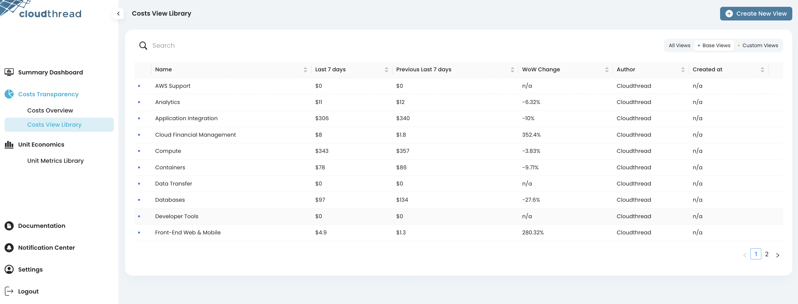

# Unit Metrics Library

**Unit Metrics Library** is the section of the app where you can see all the saved [unit-metric.md](unit-metric.md "mention") listed: both custom and predefined ones. It is a convenient entry point into cost efficiency analysis.

There are two types of metics in the Library:

* **Base** metrics are predefined by Cloudthread and are available after onboarding and data refresh
* **Custom** metrics are defined by Cloudthread users through Create New Metric form and [unit-metrics-lab.md](unit-metrics-lab.md "mention") filtering and saving functionality
  * See [creating-custom-unit-metrics.md](../../guides/creating-custom-unit-metrics.md "mention") for instructions
