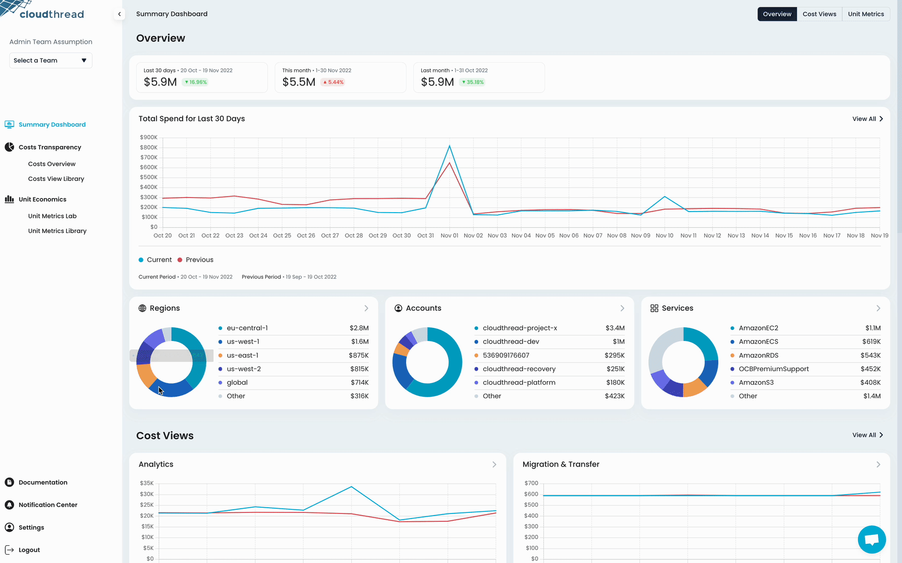

# Connecting AWS Sub-Accounts

Once you have done the initial setup by [connecting-aws-account.md](connecting-aws-account.md "mention"), you can increase the value of the platform by connecting AWS sub-accounts.

Sub-accounts are the accounts that belong to the [AWS Organisation](https://docs.aws.amazon.com/organizations/latest/userguide/orgs\_introduction.html) and that stand below the Management Account in the hierarchy, i.e. have no consolidated billing function.


You have be an **Admin** in order to perform the actions described in this guide. See [account-and-team-management.md](../fundamentals/settings/account-and-team-management.md "mention") for more details on roles and permissions.



AWS sub-accounts are added through **CloudFormation** service.


## What do I need it for? 


Connecting sub-accounts to Cloudthread is important in order to:

* See the **underutilized** **resources** and **savings recommendations** for your entire AWS footprint through [low-utilization-detection.md](../fundamentals/cost-transparency/low-utilization-detection.md "mention") feature
* Define and analyze **custom unit metrics** based on the CloudWatch monitoring data for various services with [unit-metric.md](../fundamentals/unit-metrics/unit-metric.md "mention") feature
* Have larger choice of pre-calculated unit metrics in [unit-metrics-library.md](../fundamentals/unit-metrics/unit-metrics-library.md "mention")


## Detailed instructions 

### a. Connecting a single Sub-Account

1. Go to **Settings** section from the left menu pane
2. Choose [data-collection.md](../fundamentals/settings/data-collection.md "mention") tab
3. In the table at the bottom click "Create Single Sub Account Stack"
4. Locate new row that got created in a table with Stack Status column value "ready" and click "Stack Link" in the column Link – you will be redirected to AWS
5. Login the AWS account you want to integrate
6. Follow the steps for the CloudFormation stack creation similar to the ones described in [connecting-aws-account.md](connecting-aws-account.md "mention") guide

<figure><figcaption>
Connecting single AWS sub-account
</figcaption></figure>

### b. Connecting multiple Sub-Accounts


Sometimes there is a need to connect multiple sub-accounts, and it can be very inconvenient to do so one-by-one. That is why we added the feature around bulk addition of sub-accounts through **CloudFormation StackSets.**


1. Go to **Settings** section from the left menu pane
2. Choose [data-collection.md](../fundamentals/settings/data-collection.md "mention") tab
3. In the table at the bottom locate the row Stack Status column value "created" and AWS Account ID value equal to your AWS Management Account ID
4. Click "Create Sub Account StackSet" at the end of that row
5. Locate new row that got created in a table with Stack Status column value "ready" and click "Stack Link" in the column Link – you will be redirected to AWS
6. Login the AWS account you want to integrate
7. Follow the steps for the CloudFormation stack creation similar to the ones described in [connecting-aws-account.md](connecting-aws-account.md "mention") guide

<figure><figcaption>
Connecting multiple AWS sub-accounts
</figcaption></figure>

