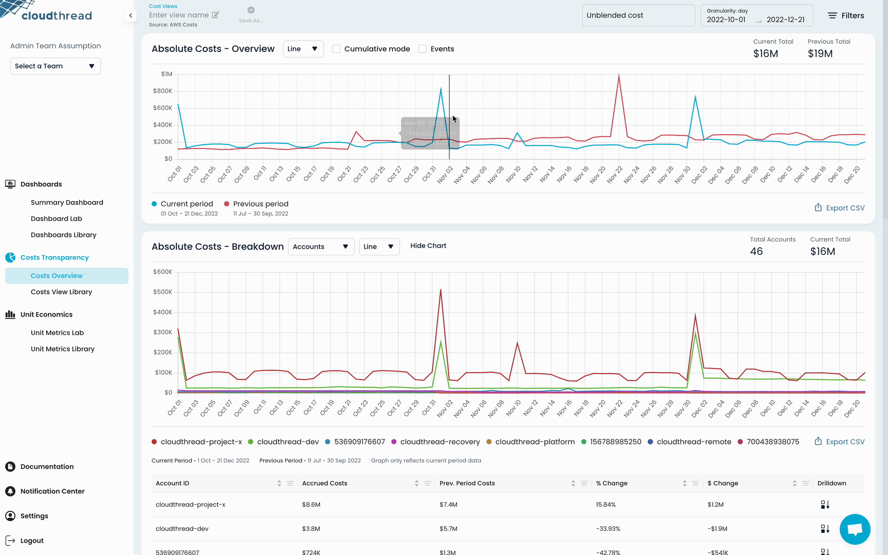

# Setting Up Events Overlay

Cloudthread allows to display custom events on the [#absolute-cost-chart](../fundamentals/cost-transparency/costs-overview.md#absolute-cost-chart "mention") in [costs-overview.md](../fundamentals/cost-transparency/costs-overview.md "mention") section. This feature is called [events-overlay.md](../fundamentals/cost-transparency/events-overlay.md "mention"). It serves as a convenient way to track cost fluctuations and perform root cause analysis.

## What do I need it for? 


Adding an Events Overlay to your absolute cloud cost chart allows to:

* **See** what event (deploy, incident, launch, marketing campaign, etc.) caused a cloud cost spike (or dip) on one chart, without the need to go drill into the data
* **Track** historical events that affected the cloud costs and use them in presentations to the leadership


## Detailed instructions 

[events-overlay.md](../fundamentals/cost-transparency/events-overlay.md "mention") relies on [custom-data-api.md](../fundamentals/custom-data-api.md "mention") for the events data upload. Below are the instructions:

1. Please, refer to the [API](http://localhost:5000/o/TmVItW5TwUC23RxcuDg9/s/KuhDuXL0YPX22VMOHZWV/ "mention") documentation for detailed instructions on how to setup a data stream
2. Once you have set up the data stream, you will be able to use the **events data stream objects**
3. Go to the [costs-overview.md](../fundamentals/cost-transparency/costs-overview.md "mention") and click on the "Events" checkbox at the top of [#absolute-cost-chart](../fundamentals/cost-transparency/costs-overview.md#absolute-cost-chart "mention")
4. See the events presented in form of blue vertical lines on the chart
5. Hover over to the line to see what type of event it is
6. refer to the table below the chart to learn more about the event

<figure><figcaption>
Setting Up Events Overlay
</figcaption></figure>
