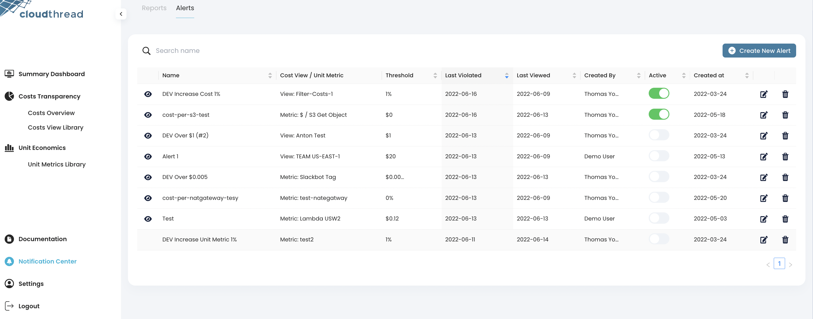

# Setting Up Alerts and Reports

Once you get familiar with [creating-custom-cost-views.md](creating-custom-cost-views.md "mention") and [creating-custom-unit-metrics.md](creating-custom-unit-metrics.md "mention"), you might want to setup [notifications](../../fundamentals/notifications/ "mention") for the views so that important insights are not missed by you and your team.

Cloudthread has two types of notifications:

* [alerts.md](../../fundamentals/notifications/alerts.md "mention") – short notifications sent on certain event (like threshold break)
* [reports.md](../../fundamentals/notifications/reports.md "mention") – detailed notifications sent on schedule


All notifications can be delivered through **e-mail** and **Slack** (see [#slack-integration](../../fundamentals/settings/slack-integration.md#slack-integration "mention") for Slack App setup instructions).


## What do I need it for? 


Using [alerts.md](../../fundamentals/notifications/alerts.md "mention") and [reports.md](../../fundamentals/notifications/reports.md "mention") will help you to:

* Get **notified** when your [cost-view.md](../../fundamentals/cost-transparency/key-concepts/cost-view.md "mention") or [unit-metric.md](../../fundamentals/unit-metrics/key-concepts/unit-metric.md "mention") break absolute or relative threshold you defined
* Receive **detailed** insights on cloud spend relevant to you every week/month/quarter
* **Subscribe** team members to important notifications so that they receive important information on their cloud costs in time


## Detailed instructions 

### Alerts


See [alerts.md](../../fundamentals/notifications/alerts.md "mention") for alert examples and details on alert types and cadence.


1. Choose **Notification Center** menu item at the bottom part of the menu to the left
2.  Navigate to **Alerts** section at the top of the screen, you will see the table listing all the alerts set up in your Cloudthread account

    
3.  Click "Create New Alert" button at the top of the table, you will see the the form with alert settings

    .png>)
4. Choose [cost-view.md](../../fundamentals/cost-transparency/key-concepts/cost-view.md "mention") or [unit-metric.md](../../fundamentals/unit-metrics/key-concepts/unit-metric.md "mention") that you want the alert to be applied to from the list
5. Specify the alert type based on the threshold type you want to apply – Absolute or Relative
   * **Absolute** thresholds are associated with a specific, absolute number (e.g. alert when costs go above $10)
   * **Relative** thresholds are associated with a percentage increase Week over Week (e.g. alert when costs increase by more than 5% compared to last week)
6. Add e-mail addresses for alert recipients
   * Multiple e-mail addresses are allowed
   * List of addresses should be comma separated
   * Note: any emails will work, they don't need to have an associated Cloudthread user
7. Choose Slack channels the alert notifications should be sent to
   * You should have Slack connected to Cloudthread, see [#slack-integration](../../fundamentals/settings/slack-integration.md#slack-integration "mention") for instructions
   * Multiple Slack channels are allowed
8. Input the alert name
9. Click "Save Alert"
10. Your alert will appear in the saved alerts table with Active switch on, i.e. the alert is active and will be fired to specified channels once the threshold is broken

### Reports


See [reports.md](../../fundamentals/notifications/reports.md "mention") for report examples and details on report types and cadence.


1. Choose **Notification Center** menu item at the bottom part of the menu to the left
2.  Navigate to **Reports** section at the top of the screen, you will see the table listing all the reports set up in your Cloudthread account

    .png>)
3.  Click "Create New Report" button at the top of the table, you will see the the form with report settings

    .png>)
4. In the **Filtering** section of the form choose one of your custom [cost-view.md](../../fundamentals/cost-transparency/key-concepts/cost-view.md "mention") that you want the report to be based on
   * All data in the report will be filtered in accordance with the chosen Cost View
   * If you chose no view, non-filtered (total) cost will be reported
5. In the **Detailed Insights** section of the form specify [unit-metric.md](../../fundamentals/unit-metrics/key-concepts/unit-metric.md "mention") and/or **Tags** that you want to be added to the report – insights on these Unit Metrics and tags will be included into the special sections of the report
   * Max 5 Unit Metrics can be added
   * Max 3 Tags can be added
6. In the **Movers and Shakers** section of the form specify settings for the corresponding report section – a summary of the biggest spend changes within your environment
   * **Minimum spend threshold** – you don't want cost movements below this absolute spend number to be included in reports or be flagged as a daily mover and shaker
     * e.g. if Absolute Spend Threshold is $10 and your Lambda pricing goes up by 500% but still only costs $9, Lambda won't show up in the reports
   * **Minimum spend change** – only changes in spend exceeding these relative or absolute thresholds will be added to the reports
     * **Absolute** thresholds are associated with a specific, absolute number
       * You don't want cost movements below this absolute change to be included in reports or be flagged as a daily mover and shaker
       * e.g. if Absolute Change Threshold is $50 and your Lambda pricing goes up from $10,020 last week to $10,050 this week, Lambda has increased by only $30 and won't show up as a Top Spender and won't show up in daily movers and shakers
     * **Relative** thresholds are associated with a percentage increase Week over Week
       * You don't want cost movements below this relative change to be included in reports or be flagged as a daily mover and shaker
       * e.g. if Relative Change Threshold is 10% and your Lambda pricing goes up from $100 last week to $109 this week, Lambda has increased by only 9% and won't show up as a Top Spender and won't show up in daily movers and shakers
   * **Daily Movers and Shakers** – this checkbox introduces a special daily report that is sent only if one of the thresholds above is broken
     * This is similar to Alert behavior, but includes more detailed information on spend changes
     * If checked, the report will be send on the threshold break event, outside of any previously set schedule
7. Add e-mail addresses for report recipients
   * Multiple e-mail addresses are allowed
   * List of addresses should be comma separated
   * Note: any emails will work, they don't need to have an associated Cloudthread user
8. Choose Slack channels the alert notifications should be sent to
   * You should have Slack connected to Cloudthread, see [Broken link](broken-reference "mention") for instructions
   * Multiple Slack channels are allowed
9. Input the report name
10. Click "Save Report"
11. Your report will appear in the saved reports table with Active switch on, i.e. the report is active and will be delivered to specified channels on schedule or daily in case **Daily Movers and Shakers checkbox was checked** and the threshold is broken


By default a report for **Total Cost** view is created as part of **onboarding** process. After you set up an account, you will be receiving a weekly report to your inbox, no action needed.


