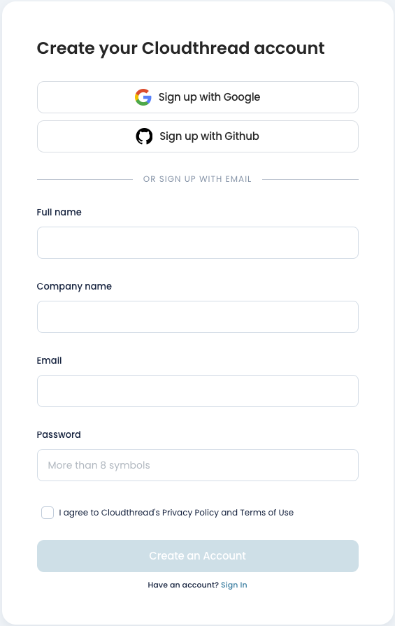
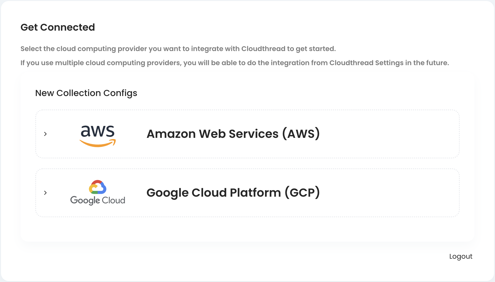

# Onboarding

Onboarding to Cloudthread platform is a streamlined process, consisting of 2 steps: setting up your account and adding permissions for your cloud environments.


Cloudthread is supporting only **AWS** at the moment. **Google Cloud** integration is on the way. If you are using other cloud providers, please let us know [here](https://www.cloudthread.io/contact-us).


## 1. Create and confirm Cloudthread account

After your account is [created](https://app.core.cloudthread.io/sign-up/) and confirmed via email, you'll be prompted to get connected to your cloud environment. The account creation process is quite standard and requires you to sign-up with email, Google or GitHub.

<figure><figcaption></figcaption></figure>

## 2. Connect your cloud environments

Connecting cloud environments is essential for Cloudthread to deliver insights and automation. Further in this guide you will find detailed instructions on how to set up AWS and GCP connections.

<figure><figcaption></figcaption></figure>

### AWS


[connecting-aws-account.md](connecting-aws-account.md)


### GCP


[connecting-gcp-billing-account.md](connecting-gcp-billing-account.md)

