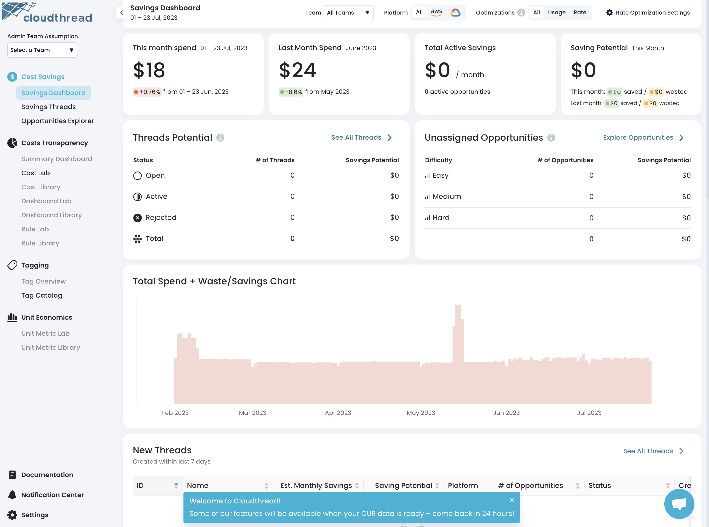

# Connecting AWS Management Account

Connecting cloud account is an **essential** part of Cloudthread onboarding process and the most fundamental part of the setup. You cannot skip this step – your organization's cloud **savings, billing, and usage data** is essential for the platform to deliver value, i.e. help you to increase efficiency of your cloud spend.

This is the guide for the **initial** data access setup, which is aimed at **AWS** **Management** **Account** (see [AWS Consolidate Billing](https://docs.aws.amazon.com/awsaccountbilling/latest/aboutv2/consolidated-billing.html) for more information). This setup fully covers:

* **Billing data (CUR)**
* **Savings Opportunity data**

## Cloudthread AWS access


We are very careful with the access to your AWS environment, you can always see and adjust the policy templates we use in your accounts. Our policies are **read-only**, except for the billing S3 bucket we setup for you with your permission.

[Cloudthread Policy](../../policy\_cfn\_cldthrd.yaml)


Cloudthread is using a delegated access role to read data from your account into the application This role has read access only to the resources necessary for generating the insights – AWS cost and usage data. This includes but not limited to:

* [AWS Cost and Usage Report](https://aws.amazon.com/aws-cost-management/aws-cost-and-usage-reporting/) (CUR)
* [AWS Cost Explorer](https://aws.amazon.com/aws-cost-management/aws-cost-explorer/) API
* [CloudWatch](https://aws.amazon.com/cloudwatch/) metrics
* [AWS Simple Storage](https://aws.amazon.com/s3) (S3)
  * To read saved CUR files
* AWS Services (EC2, RDS, ElastiCache, OpenSearch, etc.)
  * To generate usage optimization recommendations
* [AWS Trusted Advisor](http://127.0.0.1:5000/s/Q8QqeF6WFPo2rNkc3ND6/the-basics/collections) (if enabled)
  * To gather cost optimization recommendations suggested by AWS
* [AWS Compute Optimizer](https://docs.aws.amazon.com/compute-optimizer/latest/ug/what-is-compute-optimizer.html)
  * To gather compute optimization recommendations suggested by AWS


In more detail, Cloudthread needs roughly **5 sets** of permissions / actions:

1. **CUR bucket creation**, with complete access to this bucket (and only this bucket). This allows us to maintain the bucket policy overtime for any AWS changes that are required to maintain the CUR connection, and read CUR data.
2. **Describe account read access** to understand AWS Organizations structure and gather account names and tags.
3. **Cost Explorer read access** to power the first 24 hours of the tool.
4. **CloudWatch read access** to collect CloudWatch data for savings opportunity processing.
5. **Savings polices with service read access**, to detect the savings opportunities.



Before connecting your account to Cloudthread we recommend you make sure [AWS Organizations with consolidated billing](https://aws.amazon.com/organizations/) are **enabled** in your AWS environment. If you're using AWS Organizations, you will need your organziation [Root ID](https://docs.aws.amazon.com/organizations/latest/userguide/orgs\_getting-started\_concepts.html).



Cloudthread is using the most granular version of [AWS Cost and Usage Report](https://aws.amazon.com/aws-cost-management/aws-cost-and-usage-reporting/) **(CUR)** to deliver cost insights – the report can be set up form scratch by our automated onboarding process, or can be reused in case you already have it in place.


## Connecting Cloudthread via CloudFormation Stack

Cloudthread is using [**AWS CloudFormation** **(CF)** **service**](https://aws.amazon.com/cloudformation/) to enable fast and reliable integration. You **control** every part of this setup process and have full visibility into actions CF is performing with your AWS environment. At any point in time you can disconnect your account or adjust setup in [data-collection.md](../../fundamentals/settings/data-collection.md "mention") section in Cloudthread settings.

In order for Cloudthread start functioning and delivering value, AWS Management Account has to be connected. This is the first and **essential** step after the account creation ([app.cloudthread.io/sign-up](https://app.cloudthread.io/sign-up)):

### 1. Create and confirm Cloudthread account

After your account is [created](https://app.core.cloudthread.io/sign-up/) and confirmed via email, you'll be prompted to get connected to your cloud environment through either creating a new Cost and Usage Report (CUR) or using the existing one.

### 2. Choose an AWS integration option

On the cloud environment integration page you open up the **AWS** dropdown.

<figure><figcaption></figcaption></figure>

You will see the detailed instructions and a choice of AWS integration options covering most common situations:

[#a.-you-do-not-have-any-existing-cost-and-usage-report-or-want-to-use-a-new-one](connecting-aws-account.md#a.-you-do-not-have-any-existing-cost-and-usage-report-or-want-to-use-a-new-one "mention")

* a.1. You have only one account to integrate
* a.2. You have many accounts managed by [AWS Organizations](https://docs.aws.amazon.com/organizations/latest/userguide/orgs\_introduction.html)

[#b.-you-have-an-existing-cost-and-usage-report-set-up-and-want-to-use-it](connecting-aws-account.md#b.-you-have-an-existing-cost-and-usage-report-set-up-and-want-to-use-it "mention")

* b.1. You have only one account to integrate
* b.2. You have many accounts managed by [AWS Organizations](https://docs.aws.amazon.com/organizations/latest/userguide/orgs\_introduction.html)

#### A. You do not have any existing Cost and Usage Report (or want to use a new one)

Choose this option if:

* You **do not have** Cost and Usage Report set up for your AWS billing account
* You **have** Cost and Usage Report set up for your AWS billing account, but it is not corresponding to the following settings:
  * **Hourly** time granularity
  * **Parquet** file type
  * **Overwrite Report** file versioning
  * **Resource ID** level
* You **have** Cost and Usage Report set up with settings above for your AWS billing account, but do not want to use it for some reason

**A.1. You have only one account to integrate**

If you have only one account to integrate, choose the relevant option in the integration options menu.

<figure><figcaption></figcaption></figure>

Click `Go to New Report Template` to get redirected to your AWS console with ClouFormation settings already prefilled for you.

<figure><figcaption></figcaption></figure>


Make sure to log into the **AWS account** you want to integrate.


**A.2. You have many accounts managed by** [**AWS Organizations**](https://docs.aws.amazon.com/organizations/latest/userguide/orgs\_introduction.html)

If you have multiple accounts to integrate, choose the relevant option in the integration options menu.

<figure><figcaption></figcaption></figure>

Input your [Root ID](https://docs.aws.amazon.com/organizations/latest/userguide/orgs\_getting-started\_concepts.html), click `Save Stack` and proceed to CloudFormation stack setup (click `Go to New Report Template` to get redirected to AWS CloudFormation with prefilled settings).

<figure><figcaption></figcaption></figure>


Once you are redirected to AWS Cloud Formation ([next step](connecting-aws-account.md#3.-redirect-to-aws)), make sure to [Enable trusted access with AWS Organizations](https://docs.aws.amazon.com/AWSCloudFormation/latest/UserGuide/stacksets-orgs-enable-trusted-access.html).



If you have multiple accounts not tied together through [AWS Organizations](https://docs.aws.amazon.com/organizations/latest/userguide/orgs\_introduction.html), use [data-collection.md](../../fundamentals/settings/data-collection.md "mention") settings to add more accounts through **ad-hoc** single account integration option.


#### B. You have an existing Cost and Usage Report set up and want to use it

Choose this option if:

* You **have** Cost and Usage Report set up for your AWS billing account, and it corresponds to the following settings:
  * **Hourly** time granularity
  * **Parquet** file type
  * **Overwrite Report** file versioning
  * **Resource ID** level


For the report settings input:

**Report name** is the name of CUR report folder

**Report prefix** is the path to CUR folder within the bucket (everything without the last `"/")`

**Report bucket** is S3 bucket name



**B.1. You have only one account to integrate**

If you have only one account to integrate, choose the relevant option in the integration options menu.

<figure><figcaption></figcaption></figure>

Input the details of your existing Cost and Usage report and proceed to CloudFormation stack setup (click `Go to New Report Template` to get redirected to AWS CloudFormation with prefilled settings).

<figure><figcaption></figcaption></figure>

**B.2. You have many accounts managed by** [**AWS Organizations**](https://docs.aws.amazon.com/organizations/latest/userguide/orgs\_introduction.html)

If you have multiple accounts to integrate, choose the relevant option in the integration options menu.

<figure><figcaption></figcaption></figure>

Input your [Root ID](https://docs.aws.amazon.com/organizations/latest/userguide/orgs\_getting-started\_concepts.html), input the details of your Cost and Usage report and proceed to CloudFormation stack setup (click `Go to New Report Template` to get redirected to AWS CloudFormation with prefilled settings).

<figure><figcaption></figcaption></figure>


Once you are redirected to AWS Cloud Formation ([next step](connecting-aws-account.md#3.-redirect-to-aws)), make sure to [Enable trusted access with AWS Organizations](https://docs.aws.amazon.com/AWSCloudFormation/latest/UserGuide/stacksets-orgs-enable-trusted-access.html).



Choosing an existing Cost and Usage Report for Cloudthread integration has an advantage of the **full historical data**, which will be missing in case of the new report creation. However, even with the new CUR the **historical backfill is possible**, and we will help you to arrange it with your AWS TAM.



More on the properties of CUR and where to find them:

[AWS documentation](https://docs.aws.amazon.com/cur/latest/userguide/understanding-report-versions.html)

[AWS Well-Architected Labs](https://www.wellarchitectedlabs.com/cost/100\_labs/100\_1\_aws\_account\_setup/3\_cur/)


### 3. Redirect to AWS

Pressing "_Go to New Report Template_" (for new CUR integration) or "_Go to Existing Report Template_" (for existing CUR integration) to will automatically **redirect** you to your AWS console, and **pre-populate** a CF Stack with Cloudthread's required access permissions.


* Make sure you are in the right AWS account
* We recommend to start with AWS management account, i.e. the main account


### 4. Review CF stack and confirm creation


Make sure to check mark **"I acknowledge that AWS CloudFormation might create IAM resources."**



If you chose [Use an existing Cost and Usage Report](connecting-aws-account.md#b.-use-an-existing-cost-and-usage-report) integration option, the fields in the **Quick create stack** form will be pre-populated with the CUR parameters you supplied (Report name, Report prefix, Report bucket) – make sure they are correct.



**Note:** In order for Cloudthread to work, [Cost and Usage Report](https://docs.aws.amazon.com/cur/latest/userguide/what-is-cur.html) (CUR) file needs to be set up in **us-east-1** region. CloudFormation stack has it preset, but if you change the region the stack won't work.



If you used AWS Organizations setup options (a.2 and b.2 above), make sure to [Enable trusted access with AWS Organizations](https://docs.aws.amazon.com/AWSCloudFormation/latest/UserGuide/stacksets-orgs-enable-trusted-access.html).


Once you initiate CF stack creation, it will take up to an hour to setup the required resources and policies for Cloudthread to generate initial insights. Your AWS console will show something like this:

Monitor the CloudFormation creation log and troubleshoot as necessary.

### 5. Come back to Cloudthread App

If the AWS integration went through (CloudFormation creation log finished with no errors), you will see the **success** message in Cloudthread app.&#x20;

<figure><figcaption></figcaption></figure>

Clock `Continue` to start using the app and seeing the first cost insights.

<figure><figcaption></figcaption></figure>


AWS Cost and Usage Report (CUR) is being created (which can take up to 48 hours).


<figure><figcaption></figcaption></figure>


Some sections of the app are grayed out right after the integration due to CUR integration timeline.


This means that you'll have high level savings and cost analytics available through the Cost Explorer API immediately when you login and that more granular resource level data will only be available when CUR data is ready.


Once the CUR file is ready Cloudthread will **notify** you, and you will be able to see deeper insights on the platform.

**Note:** Often, when CUR file is created it does not have all the historical data – your AWS support must be contacted to **backfill** it.

