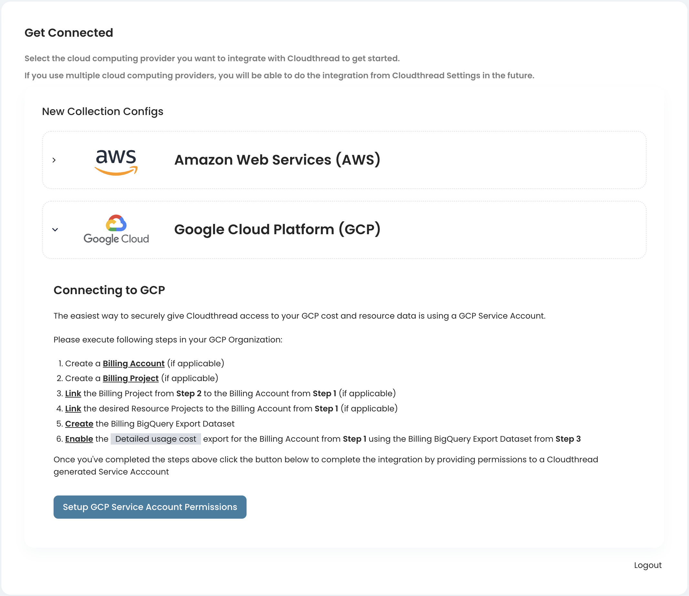
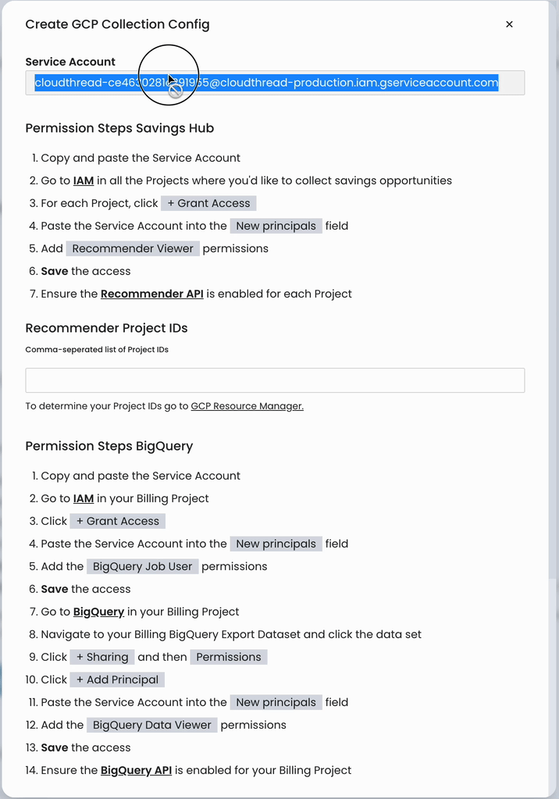
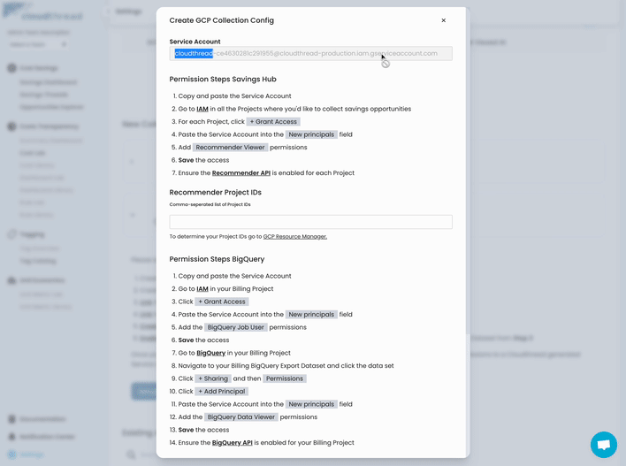
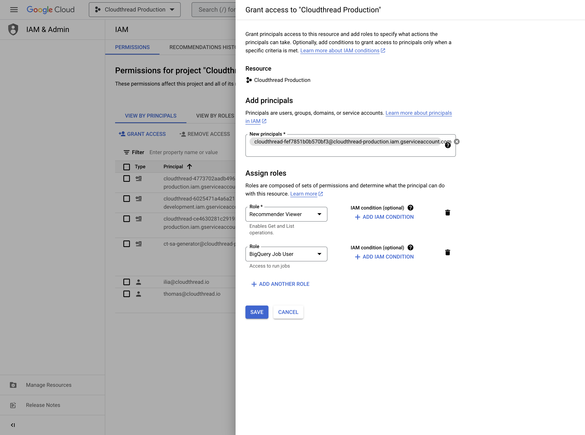
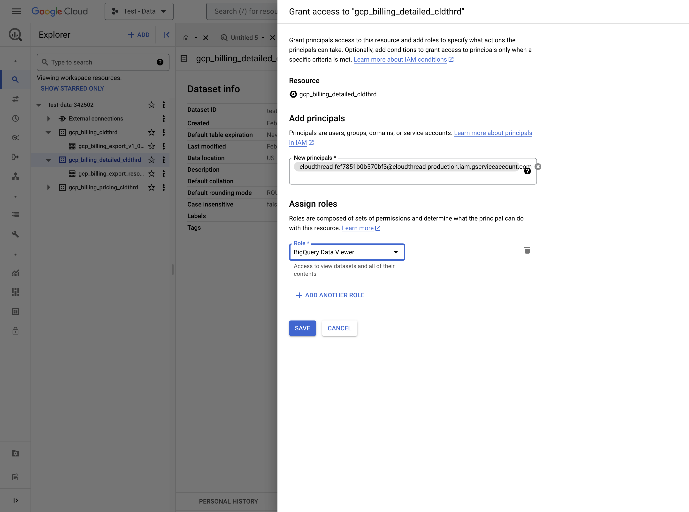
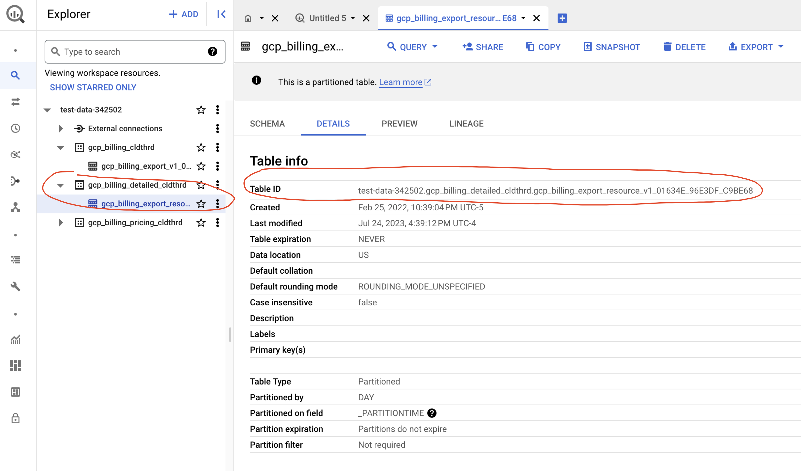
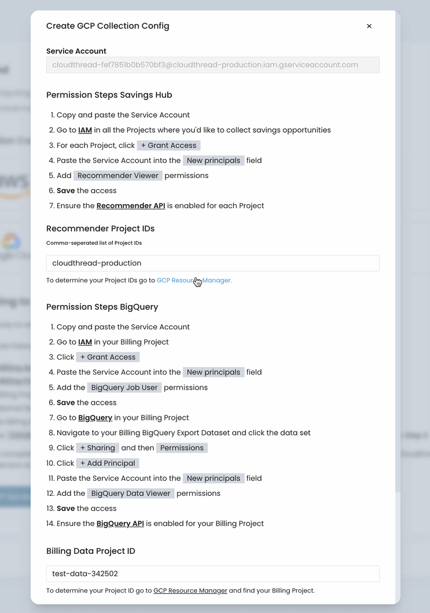
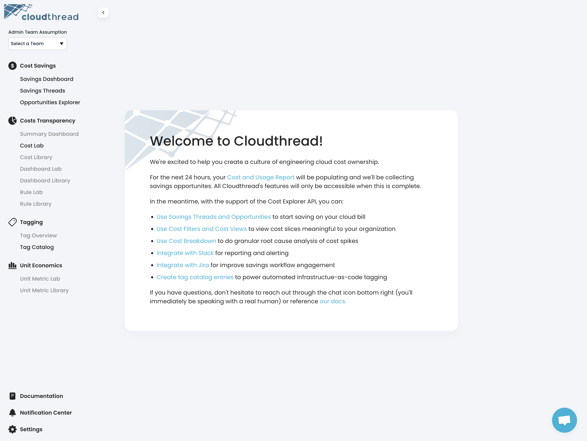
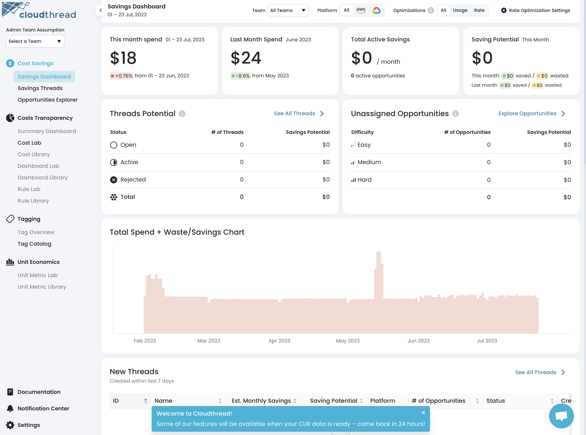

# Connecting GCP Billing Account

Connecting cloud account is an **essential** part of Cloudthread onboarding process and the most fundamental part of the setup. You cannot skip this step – your organization's cloud **savings, billing, and usage data** is essential for the platform to deliver value, i.e. help you to increase efficiency of your cloud spend.

This is the guide for the **initial** data access setup, which is aimed at **GCP** **Billing** **Account** (see [GCP Cloud Billing documentation](https://cloud.google.com/billing/docs/concepts) for more information). This setup fully covers:

## Cloudthread GCP access

## Connecting Cloudthread

### 1. Create and confirm Cloudthread account

After your account is [created](https://app.core.cloudthread.io/sign-up/) and confirmed via email, you'll be prompted to get connected to your GCP environment by following the instructions.

<figure><figcaption></figcaption></figure>

### 2. Set up GCP Billing in Big Query

Execute following steps in your GCP Organization:

1. Create a [Billing Account](https://cloud.google.com/billing/docs/how-to/create-billing-account) (if applicable)
2. Create a [Billing Project](https://cloud.google.com/billing/docs/how-to/export-data-bigquery-setup#project) (if applicable)
3. [Link](https://cloud.google.com/billing/docs/how-to/modify-project#enable\_billing\_for\_a\_project) the Billing Project from Step 2 to the Billing Account from Step 1 (if applicable)
4. [Link](https://cloud.google.com/billing/docs/how-to/modify-project#enable\_billing\_for\_a\_project) the desired Resource Projects to the Billing Account from Step 1 (if applicable)
5. [Create](https://cloud.google.com/billing/docs/how-to/export-data-bigquery-setup#create-bq-dataset) the Billing BigQuery Export Dataset
6. [Enable](https://cloud.google.com/billing/docs/how-to/export-data-bigquery-setup#enable-bq-export) the Detailed usage cost export for the Billing Account from Step 1 using the Billing BigQuery Export Dataset from Step 3

Once you've completed the steps above click the button below to complete the integration by providing permissions to a Cloudthread generated Service Account.

### 3. Setup GCP Service Account Permissions

Once the billing reporting is set up in GCP, click `Setup GCP Service Account Permissions` and fill in the **Create GCP Collection Config** form.&#x20;


**GCP Collection Config** is used to pull data from your GCP environment.


#### 3.1 Add Recommender access for target Projects

For the GCP projects you want to be covered by the [cost-savings](../../fundamentals/cost-savings/ "mention") features (leveraging GCP [Recommender API](https://console.cloud.google.com/apis/library/recommender.googleapis.com?project=cloudthread-production)) set up IAM permissions for Cloudthread in GCP Console:

1. Copy the **Service Account** in the  integration form in Cloudthread App
2. Go to [IAM](https://console.cloud.google.com/iam-admin/iam) in all the Projects where you'd like to collect savings opportunities
3. For each Project, click `+ Grant Access`
4. Paste the Service Account into the New principals field
5. Add `Recommender Viewer` permissions
6. **Save** the access
7. Ensure the [Recommender API](https://console.cloud.google.com/apis/library/recommender.googleapis.com?project=cloudthread-production) is enabled for each Project

<figure><figcaption></figcaption></figure>

Once the permissions are added and saved for each target Project, come back to Cloudthread **Create GCP Collection Config** form and add `Recommender Project IDs` to the form field.

#### 3.2 Add Billing access for target Projects

_**Step 1. Add IAM permissions for Big Query access**_

1. Copy the **Service Account** in the  integration form in Cloudthread App
2. Go to [IAM](https://console.cloud.google.com/iam-admin/iam) in your Billing Project
3. Click `+ Grant Access`
4. Paste the Service Account into the `New principals` field
5. Add the `BigQuery Job User` permissions
6. **Save** the access
7. Go to [BigQuery](http://127.0.0.1:5000/s/olpj9GP0AzTnIchRMGJ0/guides/setting-up-alerts-and-reports) in your Billing Project

<figure><figcaption></figcaption></figure>

_**Step 2. Add permissions for Billing Dataset access**_

1. Navigate to your Billing BigQuery Export Dataset and click the data set
2. Click `+ Sharing` and then `Permissions`
3. Click `+ Add Principal`
4. Paste the Service Account into the `New principals` field
5. Add the `BigQuery Data Viewer` permissions
6. **Save** the access
7. Ensure the [BigQuery API](https://console.cloud.google.com/apis/library/bigquery.googleapis.com?project=cloudthread-production) is enabled for your Billing Project

<figure><figcaption></figcaption></figure>

_**Step 3. Fill in Create GCP Collection Config form**_

Once the permissions are added and saved for each target Project, come back to Cloudthread **Create GCP Collection Config** form and:

* Add `Billing Data Project ID` to the form field
  * Make sure the Project has the billing data – it can be different from the one you enabled Recommender for.
*   Add `Billing Data Table ID` to the form filed

    * To determine your Table ID go to [GCP BigQuery](https://console.cloud.google.com/bigquery) and select your Billing BigQuery Export Dataset and find the `Detailed usage cost` Table ID in the table Details

    

### 4. Validate and Save the **GCP Collection Config**

Once the permissions are set up in GCP console and GCP Collection Config form is filled, click  `Validate` to make sure the integration has no errors. If this is the case, click `Save Config` to enable the integration.

If the GCP integration went through, you will see the **success** message in Cloudthread app.&#x20;

<figure><figcaption></figcaption></figure>

Clock `Continue` to start using the app and seeing the first cost insights.

<figure><figcaption></figcaption></figure>

<figure><figcaption></figcaption></figure>


Some sections of the app are grayed out right after the integration due to data pull integration timeline.

