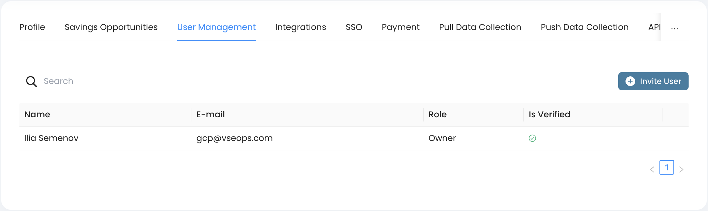
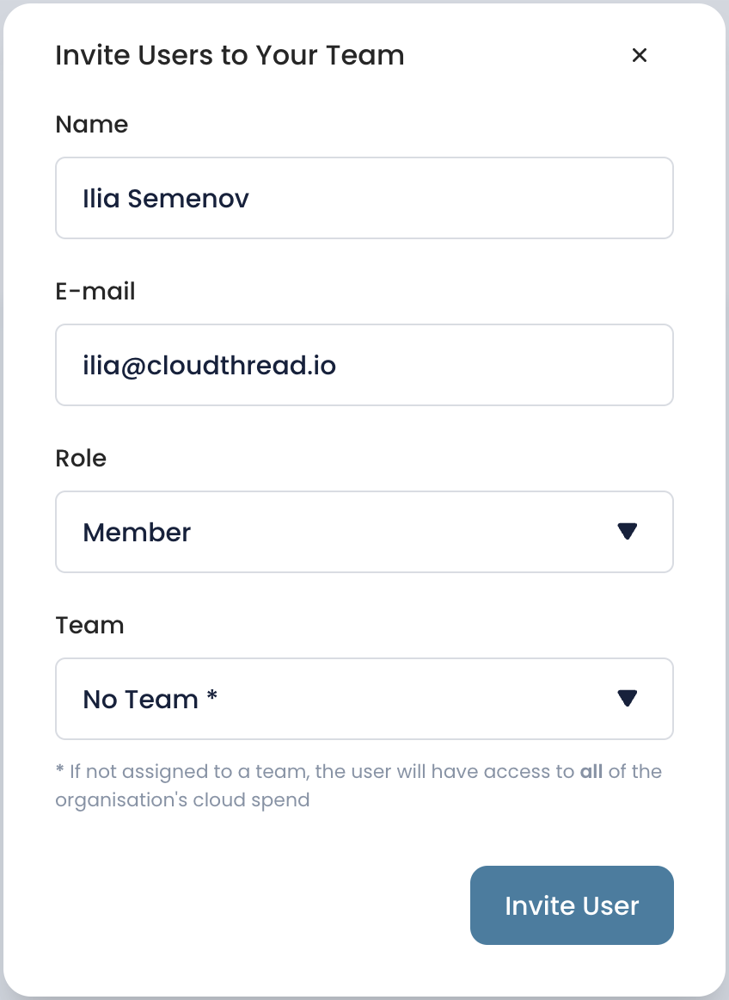

# Adding new Users

As you did the initial setup getting first [cost-view.md](../../fundamentals/cost-transparency/key-concepts/cost-view.md "mention") and [unit-metric.md](../../fundamentals/unit-metrics/key-concepts/unit-metric.md "mention") defined, you might want to invite more users to Cloudthread, so that they can see insights and create their own views and metrics o track.


You have be an **Admin** in order to invite new team members. See [account-and-team-management.md](../../fundamentals/settings/account-and-team-management.md "mention") for more details on roles and permissions.


## What do I need it for? 


Adding new users to the platform will enable the following:

* More **people** in you organization will be able to see cost **insights** and [optimization-opportunities.md](../../fundamentals/cost-savings/key-concepts/optimization-opportunities.md "mention") in a convenient form
* Engineers will be able to dig into the costs and unit metrics to understand how their workflows impact cloud spend and efficiency – this can enable **engineering accountability**
* More people will be able to create [cost-view.md](../../fundamentals/cost-transparency/key-concepts/cost-view.md "mention") and [unit-metric.md](../../fundamentals/unit-metrics/key-concepts/unit-metric.md "mention") so that company's library has wider range of insights


## Detailed instructions 

1. Go to **Settings** section from the left menu pane
2.  Choose **User Management** tab

    

    <figure><figcaption></figcaption></figure>

    

3. Click `Invite User` button
4.  Fill in the user invite form

    * User Name and e-mail are required
    * Choose team for the user if applicable, see [teams.md](../../fundamentals/settings/teams.md "mention") for more info

    

    <figure><figcaption></figcaption></figure>

    

5. Push "Add New User"
6. Invited user should receive an e-mail and be able to sign up to Cloudthread


Cloudthread's [pricing](https://www.cloudthread.io/pricing) is **not based on number of users** – we do not want to create wrong incentives and discourage people in your organization to use the app and see valuable cloud efficiency insights.

