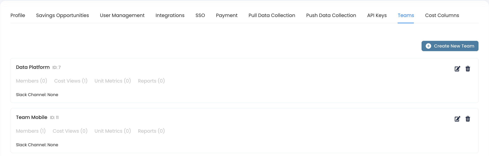
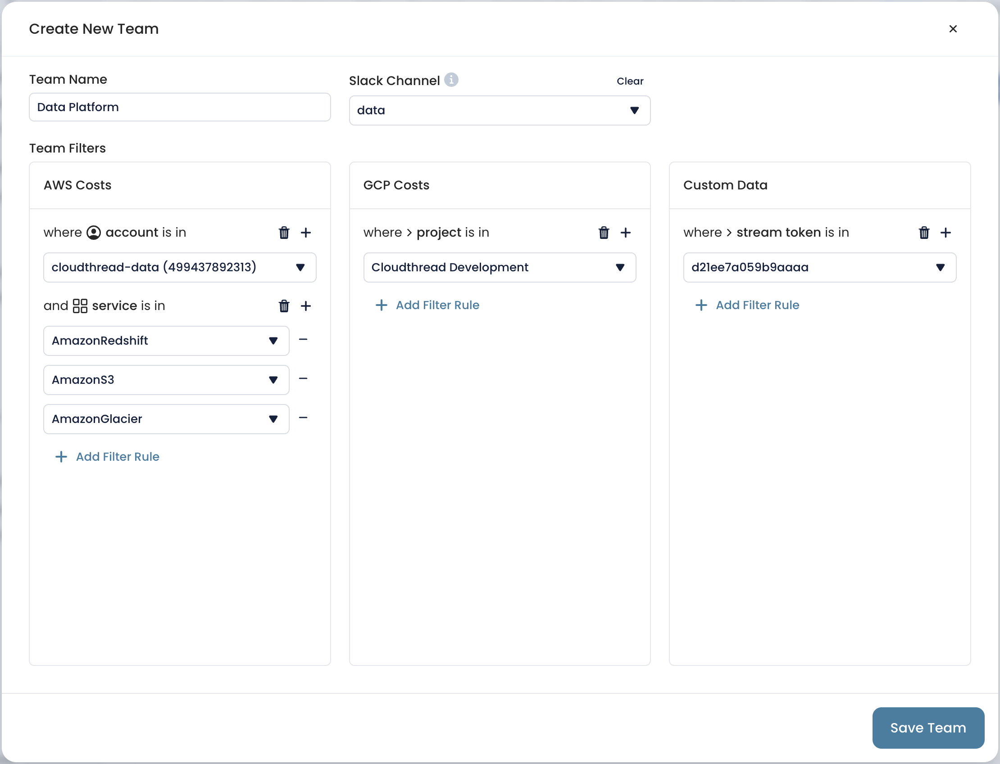
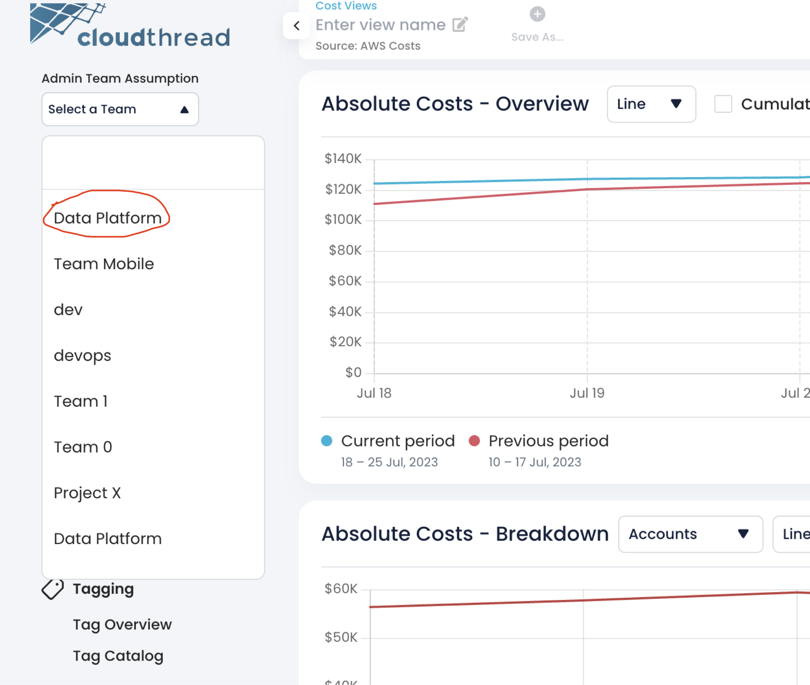

# Setting up Teams

Cloudthread platform allows to assign users to [teams.md](../../fundamentals/settings/teams.md "mention") that have **global filters** enabled, i.e. every user belonging to the Team can see all the data filtered without an ability to remove the filtering.

This feature allows to restrict the access to the sensitive data across the complex organizational structure.


You have be an **Admin** in order to set up Teams. See [teams.md](../../fundamentals/settings/teams.md "mention") for more details on the functionality.


## What do I need it for? 


Setting up teams allows to:

* **Restrict** the access of the certain group of users to the data that is relevant only to them
* **Manage** alerting and reporting at Team level, with dedicated Slack channel
* Assign Custom [cost-columns.md](../../fundamentals/settings/cost-columns.md "mention") to the Team


## Detailed instructions 

1. Go to [settings](../../fundamentals/settings/ "mention") section from the left menu pane
2.  Choose [teams.md](../../fundamentals/settings/teams.md "mention") tab

    

    <figure><figcaption></figcaption></figure>

    

3. Click `Create New Team`
4.  Fill in Team Name, add Slack channel (if applicable, see [#slack-integration](../../fundamentals/settings/slack-integration.md#slack-integration "mention") for details)

    

    <figure><figcaption></figcaption></figure>

    

5. Set up the **global team filter**
   * There are three separate filter buckets: AWS, GCP and Custom Data (see [custom-data-api.md](../../fundamentals/custom-data-api.md "mention") for details)
   * The filter is editable by Admin after the team is created
6. Click `Save Team`
7.  See the team appear in the table in Settings and in the Admin Team Assumption drop-down at the left menu pane

    

    <figure><figcaption></figcaption></figure>

    

8. Add [cost-view.md](../../fundamentals/cost-transparency/key-concepts/cost-view.md "mention") to the newly created team as necessary
   * These Cost Views will be available for the team with the global filter applied on top (in addition to any existing filters)
   * By default, the Team members have no previously created custom Cost Views available to them
9. Assume the created team through the drop-down at the left menu pane to check if everything was set up correctly


Team global filter is applied across all the features of Cloudthread, i.e. Savings Hub and Unit Metrics will be restricted based on filter rules.

