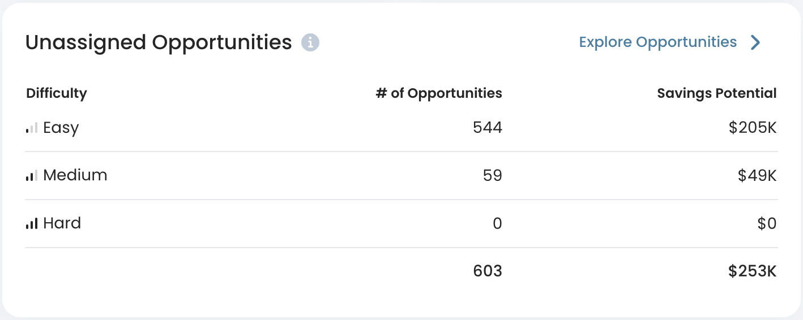
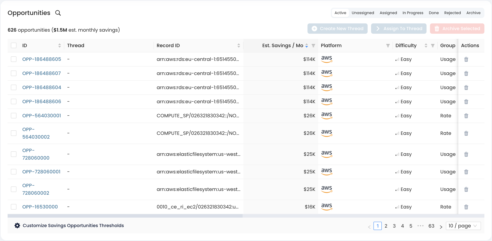

# Analyzing Savings Opportunities

Once your AWS accounts are **connected** (see [onboarding](../onboarding/ "mention")), Cloudthread is ready to serve you **cost optimization insights.** This guide will walk you through the analysis of the [optimization-opportunities.md](../../fundamentals/cost-savings/key-concepts/optimization-opportunities.md "mention") on the platform.


If you are looking for **general cost analytics**, see [monitoring-cloud-costs](../monitoring-cloud-costs/ "mention") guide section.


## What do I need it for?


Analyzing [optimization-opportunities.md](../../fundamentals/cost-savings/key-concepts/optimization-opportunities.md "mention") can help you to:

* Review the **state** of cost optimization of your cloud environments
* Understand the most **impactful** actions with the **highest savings potential**
* Dig into specific recommendations to understand their **complexity** and **risks**


## App sections


[savings-dashboard.md](../../fundamentals/cost-savings/savings-dashboard.md)



[opportunities-explorer.md](../../fundamentals/cost-savings/opportunities-explorer.md)


## Detailed instructions

1. Navigate to [savings-dashboard.md](../../fundamentals/cost-savings/savings-dashboard.md "mention") section in [cost-savings](../../fundamentals/cost-savings/ "mention") space in the menu to the left
   * You will see a dashboard with the high-level information on the state of cost optimization within your cloud environment
   *   If you have not created any [savings-threads.md](../../fundamentals/cost-savings/key-concepts/savings-threads.md "mention"), most of the tables of the dashboard will be empty, you will need to look at [#cost-insights-cards](../../fundamentals/cost-savings/savings-dashboard.md#cost-insights-cards "mention") and [#opportunity-tables](../../fundamentals/cost-savings/savings-dashboard.md#opportunity-tables "mention") to get the first impression of the savings potential

       

       <figure><figcaption></figcaption></figure>

       

2. Navigate to [opportunities-explorer.md](../../fundamentals/cost-savings/opportunities-explorer.md "mention") section in [cost-savings](../../fundamentals/cost-savings/ "mention") space in the menu to the left to review the concrete optimization opportunities
   * You can also click "Explore Opportunities" at the top right of [#opportunity-tables](../../fundamentals/cost-savings/savings-dashboard.md#opportunity-tables "mention")
   *   You will see the [#opportunities-table](../../fundamentals/cost-savings/opportunities-explorer.md#opportunities-table "mention") with all the opportunities found by Cloudthread

       

       <figure><figcaption></figcaption></figure>

       

3. Adjust **sorting** and **filter** [#opportunities-table](../../fundamentals/cost-savings/opportunities-explorer.md#opportunities-table "mention")
   * Sort by estimated potential savings, difficulty or any other available dimensions (see [opportunities-explorer.md](../../fundamentals/cost-savings/opportunities-explorer.md "mention") for more details)
4. Click on Opportunity ID field for an opportunity that you want to explore deeper
   * You will be redirected to [#opportunity-details-page](../../fundamentals/cost-savings/opportunities-explorer.md#opportunity-details-page "mention")
5. If some of the opportunities revealed by Cloudthread seem **irrelevant**, select the corresponding rows of the [#opportunities-table](../../fundamentals/cost-savings/opportunities-explorer.md#opportunities-table "mention") by clicking checkmarks at the left of the row and then click [#archive-selected-button](../../fundamentals/cost-savings/opportunities-explorer.md#archive-selected-button "mention")
   * Archiving can also be performed at a single row level by clicking trash bin icon at the right of the row


Once you have an idea of cost savings opportunities present, you can start creating the **workflows** around them. See [creating-saving-threads.md](creating-saving-threads.md "mention") guide for further details.


