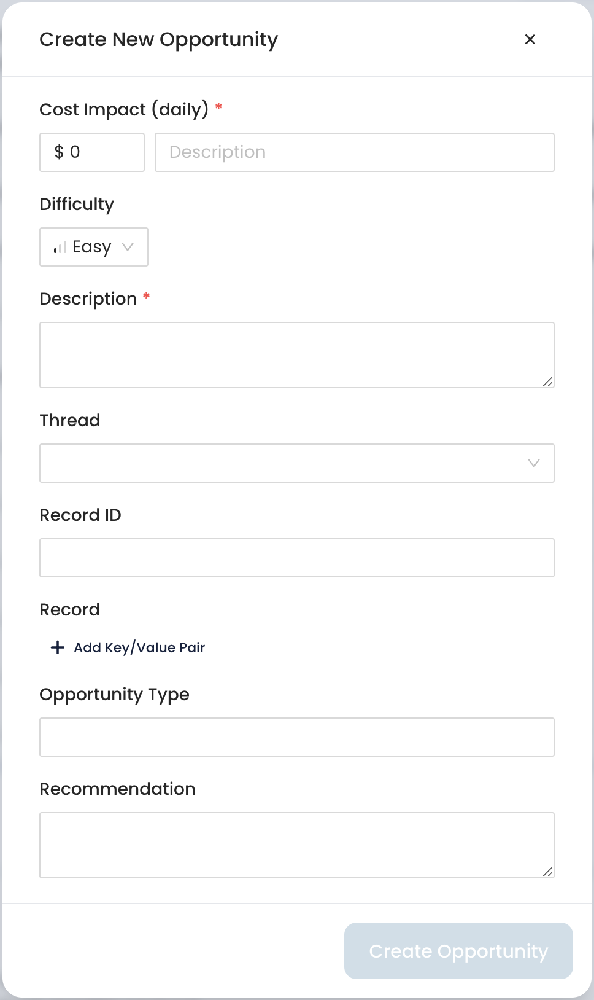

# Creating Custom Optimization Opportunities

Cloudthread **automatically** analyzes your cloud environment and identifies [optimization-opportunities.md](../../fundamentals/cost-savings/key-concepts/optimization-opportunities.md "mention"). However, the platform also supports creation of **custom** opportunities for **ad-hoc** optimization needs (see [#optimization-type](../../fundamentals/cost-savings/key-concepts/optimization-opportunities.md#optimization-type "mention") for more details).

## What do I need it for?


Creating custom [optimization-opportunities.md](../../fundamentals/cost-savings/key-concepts/optimization-opportunities.md "mention") can help you to:

* **Share** your ad-hoc optimization tasks through [savings-threads.md](../../fundamentals/cost-savings/key-concepts/savings-threads.md "mention")
* **Review the** enriched context enriched context and implementation instructions
* **Track** the progress of recommendation implementation via statuses


## App sections


[opportunities-explorer.md](../../fundamentals/cost-savings/opportunities-explorer.md)


## Detailed instructions

1. Navigate to [opportunities-explorer.md](../../fundamentals/cost-savings/opportunities-explorer.md "mention") section in [cost-savings](../../fundamentals/cost-savings/ "mention") space in the menu to the left to review the concrete optimization opportunities
2. Click [#create-new-opportunity-button](../../fundamentals/cost-savings/opportunities-explorer.md#create-new-opportunity-button "mention")
3. Fill in the form by entering estimated **Cost Impact**, Opportunity **Description,** Opportunity **Difficulty** as well as by assigning [savings-threads.md](../../fundamentals/cost-savings/key-concepts/savings-threads.md "mention"), Resource ID, Opportunity **Type** and Recommendation
   * 
   * As you can see you can form the optimization opportunity from scratch and assign it to actual cloud resource that Cloudthread platform sees in your cloud environment
4. You will see the custom opportunity in [opportunities-explorer.md](../../fundamentals/cost-savings/opportunities-explorer.md "mention")
