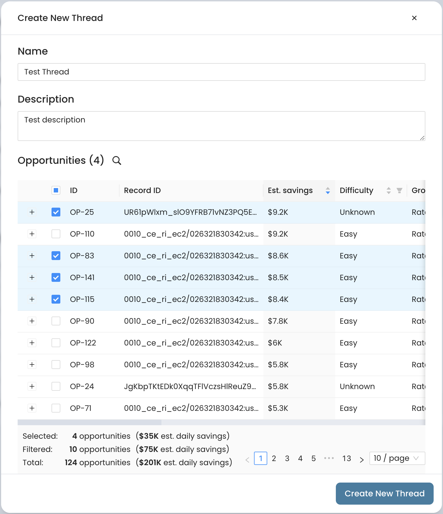

# Creating Saving Threads

Once you have analyzed the optimization opportunities found in your cloud environment by Cloudthread (see [analyzing-optimization-opportunities.md](analyzing-optimization-opportunities.md "mention")), you can sart creating the **workflows** around them. This guide will walk you through the creation of your first **cost optimization workflow** with [savings-threads.md](../../fundamentals/cost-savings/key-concepts/savings-threads.md "mention").

## What do I need it for?


Creating [savings-threads.md](../../fundamentals/cost-savings/key-concepts/savings-threads.md "mention") can help you to:

* **Group** [optimization-opportunities.md](../../fundamentals/cost-savings/key-concepts/optimization-opportunities.md "mention") into a **mini-project** for easier implementation down the line
* **Analyze** the enriched context and implementation
* **Share** the enriched context on the group of opportunities with stakeholders through Jira
  * See [#jira-integration](../../fundamentals/settings/slack-integration.md#jira-integration "mention") for instructions on setting up the integration
* **Review the** enriched context enriched context and implementation instructions
* **Track** the progress of recommendation implementation via statuses


## App sections


[savings-threads-app-section.md](../../fundamentals/cost-savings/savings-threads-app-section.md)



[opportunities-explorer.md](../../fundamentals/cost-savings/opportunities-explorer.md)


## Detailed instructions

1. Navigate to [savings-threads-app-section.md](../../fundamentals/cost-savings/savings-threads-app-section.md "mention") in the menu to the left
2. Click [#create-new-thread-button](../../fundamentals/cost-savings/savings-threads-app-section.md#create-new-thread-button "mention")
3. Fill in the form by entering Thread **Name**, Thread **Description** and by choosing the [optimization-opportunities.md](../../fundamentals/cost-savings/key-concepts/optimization-opportunities.md "mention") from the table
   * The table in the form is similar to [#unassigned-opportunities-table](../../fundamentals/cost-savings/opportunities-explorer.md#unassigned-opportunities-table "mention") in [opportunities-explorer.md](../../fundamentals/cost-savings/opportunities-explorer.md "mention")
     * It is possible to create the thread from [opportunities-explorer.md](../../fundamentals/cost-savings/opportunities-explorer.md "mention") by choosing the opportunities in the table over there and clicking [#assign-to-thread-button](../../fundamentals/cost-savings/opportunities-explorer.md#assign-to-thread-button "mention")
   * 
4. You will be redirected to [#savings-thread-details-page](../../fundamentals/cost-savings/savings-threads-app-section.md#savings-thread-details-page "mention") where you can see the enriched context
5. Click [#start-workflow-button](../../fundamentals/cost-savings/savings-threads-app-section.md#start-workflow-button "mention") to create Jira ticket associated with the created Thread
   * See [#jira-integration](../../fundamentals/settings/slack-integration.md#jira-integration "mention") for instructions on setting up the integration
